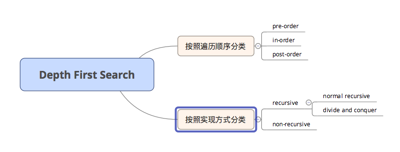

# 高效刷 LeetCode

## `Binary Search 二分查找`
特点：逐渐缩小范围，每一次可以删掉一部分（不一定要一半），难点在于分析该怎么移动使得删除后原来的属性没有变化。
适用类型：1. 已经排好序，2.找峰值。

Problem | Remark | Python | C++ 
:------- | :----- | :----: | :----: 
[704. Binary Search](https://github.com/jianfa/myLeetcode/blob/master/code/704.md) | Binary Search 模板 | √ | 
[162. Find Peak Element](https://github.com/jianfa/myLeetcode/blob/master/code/162.md) | 找峰值 | √ | 
[4. Median of two ssorted array](https://github.com/jianfa/myLeetcode/blob/master/code/4.md) | 找Kth值 | √ | 
[34. Find First and Last Position of Element in Sorted Array](https://github.com/jianfa/myLeetcode/blob/master/code/34.md) | 套用704的模板就行 | √ | 
[74. Search a 2D Matrix](https://github.com/jianfa/myLeetcode/blob/master/code/74.md) | 套用704的模板就行 | √ |
[153. Find Minimum in Rotated Array](https://github.com/jianfa/myLeetcode/blob/master/code/153.md) | 套用704的模板就行 | √ |
[81. Search in Rotated Array II](https://github.com/jianfa/myLeetcode/blob/master/code/81.md) | 套用704的模板就行,注意mid = left= right的情况 | √ |
[302. Smallest rectangel enclosing black pixels](https://github.com/jianfa/myLeetcode/blob/master/code/302.md) | 用binary search分别找四个边界 | √ |


## `Breadth first search`

适合找minimum depth 或者step类型的题目

BFS 三步骤：  
1. find start node  
2. update level node list  
3. the ending condition 


Problem | Remark | Python | C++ 
:------- | :----- | :----: | :----: 
[102. Binary Tree Level Traversal](https://github.com/jianfa/myLeetcode/blob/master/code/102.md) | BFS模板 | √ | 
[310. Minimum Height Tree](https://github.com/jianfa/myLeetcode/blob/master/code/310.md) | BFS bottom-up的应用 | √ | 
[542. 01 Matrix](https://github.com/jianfa/myLeetcode/blob/master/code/542.md) | BFS bottom-up的应用 | √ | 
[127. Word Ladder](https://github.com/jianfa/myLeetcode/blob/master/code/127.md) | BFS top-down| √ | 
[934. Shortest Bridge](https://github.com/jianfa/myLeetcode/blob/master/code/934.md) | 两遍BFS top-down| √ | 
[407. Trapping Rain Water II](https://github.com/jianfa/myLeetcode/blob/master/code/407.md) | minimum heap + bottom-up BFS| √ | 
[743. Network Delay Time](https://github.com/jianfa/myLeetcode/blob/master/code/743.md) | Graph+Dijkstra+heap | √ | 


## `DFS`



Recursive traversal 和divide and conquer最大的区别在于怎么返回结果，recursive traversal把结果放在参数中返回，每一次修改的是同一个变量，比较省空间。而divide and conquer是把结果单独返回，这样可以把左右子树返回的结果进行比较，缺点是比较费空间。所有需要对左右子树进行比较的问题，都需要用divide and conquer。

Problem | Remark | Python | C++ 
:------- | :----- | :----: | :----: 
[DFS 模板](https://github.com/jianfa/myLeetcode/blob/master/code/dfs_template.md) | DFS 9种实现方式模板| √ | 
[529. Minesweeper](https://github.com/jianfa/myLeetcode/blob/master/code/529.md) | DFS | √ | 
[530. Minimum Absolute Difference in BST](https://github.com/jianfa/myLeetcode/blob/master/code/530.md) |  BST,in-order traversal, non-recursive traversal | √ | 
[897. Increasing Order Search Tree](https://github.com/jianfa/myLeetcode/blob/master/code/897.md) | DFS,用generator | √ | 
[124. Binary Tree Maximum Path Sum](https://github.com/jianfa/myLeetcode/blob/master/code/124.md) |DFS, divide and conquer | √ |
[110. Balanced Binary Tree](https://github.com/jianfa/myLeetcode/blob/master/code/110.md) |DFS, divide and conquer | √ |
[79. Word Search](https://github.com/jianfa/myLeetcode/blob/master/code/79.md) |DFS+backtracking | √ |
[98. Validate Binary Search Tree](https://github.com/jianfa/myLeetcode/blob/master/code/98.md) |Inorder DFS | √ |
[144. Binary Tree Preorder Traversal](https://github.com/jianfa/myLeetcode/blob/master/code/144.md) |Preorder DFS | √ |


## `Dynamic programming`
DP的本质是减少循环和重复计算次数，用空间换取时间。
这些问题可以用到DP：  
  1. 找最大/最小  
  2. Yes/No  
  3. Count  

用DP解题，分四个步骤  
1. state function  
2. initialization  
3. update function  
4. final result  
 
  DP问题的最大难点在于对state function的构造，以及如何update。  
  
Problem | Remark | Python | C++ 
:------- | :----- | :----: | :----: 
[120. Triangle](https://github.com/jianfa/myLeetcode/blob/master/code/120.md) | 标准动规题 | √ |  
[121. Best Time to Buy and Sell Stock]( <https://github.com/jianfa/myLeetcode/blob/master/code/121.md>  ) | stock 类问题的模板 | √ |
[122. Best Time to Buy and Sell Stock II]( <https://github.com/jianfa/myLeetcode/blob/master/code/122.md>  ) |使用121的模板 | √ |
[123. Best Time to Buy and Sell Stock III]( <https://github.com/jianfa/myLeetcode/blob/master/code/123.md>  ) |使用121的模板 | √ |
[714. Best Time to Buy and Sell Stock with Transaction Fee]( <https://github.com/jianfa/myLeetcode/blob/master/code/714.md>  ) |使用121的模板 | √ |
[188. Best Time to Buy and Sell Stock IV]( <https://github.com/jianfa/myLeetcode/blob/master/code/188.md>  ) |使用121的模板，稍微修改，注意K值大的情况特殊处理| √  |
[309. Best Time to Buy and Sell Stock with Cooldown]( <https://github.com/jianfa/myLeetcode/blob/master/code/309.md>  ) |使用121的模板，稍微修改，注意三种状态同时刷新|  √  |
[322. Coin Change]( <https://github.com/jianfa/myLeetcode/blob/master/code/322.md>  ) |DP | √ |
[718. Maximum Length of Repeated Subarray]( <https://github.com/jianfa/myLeetcode/blob/master/code/718.md>  ) |2D array DP | √ |
[10. Regular Expression Matching]( <https://github.com/jianfa/myLeetcode/blob/master/code/10.md>  ) |DP和recusive都可以做| √ |
[44. Wildcard Matching]( <https://github.com/jianfa/myLeetcode/blob/master/code/44.md>  ) |DP| √ |

## `Backtracking`

backtracking 的问题非常好套用模板,基本的模板就是

```
class Solution:
	def solution(self, nums: List[int]) -> List[List[int]]:
		# input control
		# preprocess data, for example, sorting
		self.res = [] # a list to store all valid states
		self.backtrack(nums, [], 0) 
		# where nums:-> candidate list, 
		# []: -> current state variable or a kind of combination,
		# 0:-> index variable
		return self.res
		
	def backtrack(self, nums, state, cur_idx):
		# ending condition and operation (whether append the state to self.res)
		if cur_idx == len(nums):
			self.res.append(state)
			return
		# while loop or for loop
		while cur_idx < len(nums):
			# update state
			state.append(nums[cur_idx])
			# recursion
			self.backtrack(nums, state, cur_idx+1)
			# restore state
			state.pop() 
			# may need to skip duplicate values
			
			# update index
			cur_idx += 1
		return 
		 
```

Problem | Remark | Python | C++ 
:------- | :----- | :----: | :----: 
[90. Subsets II]( <https://github.com/jianfa/myLeetcode/blob/master/code/90.md>  ) | Backtracking 模板 | √ |
[52. N-Queens II]( <https://github.com/jianfa/myLeetcode/blob/master/code/52.md>  ) | backtracking + DP | √ |
[842. Split Array into Fibonacci Sequence]( <https://github.com/jianfa/myLeetcode/blob/master/code/842.md>  ) | two loops  | √ |
[216. Combination Sum III]( <https://github.com/jianfa/myLeetcode/blob/master/code/216.md>  ) | backtracking | √ |
[37. Sudoku Solver]( <https://github.com/jianfa/myLeetcode/blob/master/code/37.md>  ) |用模板就行| √ |


## `Divide and conquer`

Problem | Remark | Python | C++ 
:------- | :----- | :----: | :----: 
[215. Kth Largest Element in an Array]( <https://github.com/jianfa/myLeetcode/blob/master/code/215.md>  ) |  | √ |
[23. Merge k Sorted Lists]( <https://github.com/jianfa/myLeetcode/blob/master/code/23.md>  ) |  | √ |
[53. Maximum Subarray]( <https://github.com/jianfa/myLeetcode/blob/master/code/53.md>  ) |  | √ |
[54. Spiral Matrix]( <https://github.com/jianfa/myLeetcode/blob/master/code/54.md>  ) |  | √ |
[395. Longest Substring with At Least K Repeating Characters]( <https://github.com/jianfa/myLeetcode/blob/master/code/395.md>  ) |  | √ |
[59. ]( <https://github.com/jianfa/myLeetcode/blob/master/code/.md>  ) |未做|  |
[644. ]( <https://github.com/jianfa/myLeetcode/blob/master/code/.md>  ) |未做|  |


## `Topological Sort`
BFS Template:
1. Convert to adjancency matrix,outEdges
2. Create a inEdgeCount list
3. Create a toVisit queue
4. Count the number of visited node

Problem | Remark | Python | C++ 
:------- | :----- | :----: | :----: 
[207. Course Schedule]( <https://github.com/jianfa/myLeetcode/blob/master/code/207.md>  ) |Topological Sort + BFS,模板| √ |
[210. Course Schedule II]( <https://github.com/jianfa/myLeetcode/blob/master/code/210.md>  ) |Topological Sort + BFS,用207模板| √ |
[444. Sequence Reconstruction]( <https://github.com/jianfa/myLeetcode/blob/master/code/444.md>  ) |Topological Sort + BFS,用207模板，用dict存graph和indegree| √ |
[269. ]( <https://github.com/jianfa/myLeetcode/blob/master/code/.md>  ) |未做|  |
[329. ]( <https://github.com/jianfa/myLeetcode/blob/master/code/.md>  ) |未做|  |


## `Bit Manipulation 位运算`

Problem | Remark | Python | C++ 
:------- | :----- | :----: | :----: 
[338. Counting Bits]( <https://github.com/jianfa/myLeetcode/blob/master/code/338.md>  ) |i & (i - 1)| √ |
[78. Subsets]( <https://github.com/jianfa/myLeetcode/blob/master/code/78.md>  ) |bit manipulation or backtracking| √ |
[136. Single Number]( <https://github.com/jianfa/myLeetcode/blob/master/code/136.md>  ) |XOR| √ |
[137. Single Number II]( <https://github.com/jianfa/myLeetcode/blob/master/code/137.md>  ) |XOR| √ |
[260. Single Number III]( <https://github.com/jianfa/myLeetcode/blob/master/code/260.md>  ) |XOR| √ |

## `Array`

Problem | Remark | Python | C++ 
:------- | :----- | :----: | :----: 
[977. Squares of a Sorted Array]( <https://github.com/jianfa/myLeetcode/blob/master/code/977_Squares_of_a_sorted_array.md>  ) || √ |


## `Stack 栈`

Monotone stack:  
1. Monotone increasing stack  
2. Monotone decreasing stack  
选哪个的关键在于什么时候出栈，如果是希望右边的值比较大时候弹出，即找到右边第一个比当前值大的数时弹出，就用decreasing stack，
如果是希望右边的值比较小时弹出，即找到右边第一个比当前值小的数时弹出，就用increasing stack。  
用monotone stack要注意，由于经常是为了找位置，所以推入栈的经常是位置。  
利用 monotone stack的时间复杂度是O(N)

Problem | Remark | Python | C++ 
:------- | :----- | :----: | :----: 
[42. Trapping Rain Water](https://github.com/jianfa/myLeetcode/blob/master/code/42.md) | Decreasing stack | √ | 
[85. Largest Rectangle in Histogram](https://github.com/jianfa/myLeetcode/blob/master/code/85.md) | Increasing stack | √ | 
[155. Min Stack] | 最小值栈 | √ | 

## `Linked List 链表`

Problem | Remark | Python | C++ 
:------- | :----- | :----: | :----: 


## `String 字符串`

Problem | Remark | Python | C++ 
:------- | :----- | :----: | :----: 
[5. Longest Palindromic Substring](https://github.com/jianfa/myLeetcode/blob/master/code/5.md) | Expand around center / manacher's algorithm | √ | 


## `Tree 树`

Problem | Remark | Python | C++ 
:------- | :----- | :----: | :----: 


## `Hash Table 哈希表`

Problem | Remark | Python | C++ 
:------- | :----- | :----: | :----: 
[36. Valid Sudoku]( <https://github.com/jianfa/myLeetcode/blob/master/code/36.md>  ) | 用set就行 | √ |
[340. Longest Substring with At Most K Distinct Characters]( <https://github.com/jianfa/myLeetcode/blob/master/code/340.md>  ) | OrderedDict | √ |


## `Math 数学`

Problem | Remark | Python | C++ 
:------- | :----- | :----: | :----: 
[1250. Check If It Is a Good Array]( <https://github.com/jianfa/myLeetcode/blob/master/code/1250.md>  ) | Greatest Common Divisor (GCD/Bezout) 辗转相除法| √ |


[算法笔记模板](https://github.com/jianfa/myLeetcode/blob/master/template.md)

The template is credited to [Decalogue](https://github.com/Decalogue/AlgorithmMap)

 Copyright © 2019 Jianfa. All Rights Reserved.`


