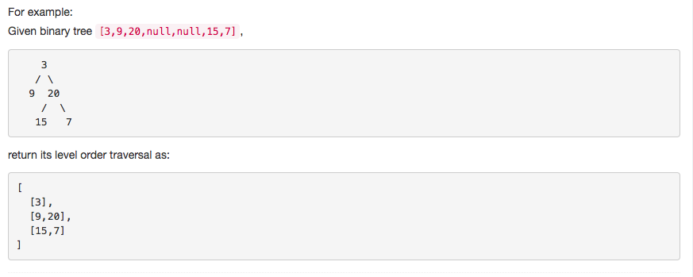

# 问题：102
# Problem: [Binary Tree Level Order Traversal](https://leetcode.com/problems/binary-tree-level-order-traversal/description/)

## 描述 Description
> ### Given a binary tree, return the level order traversal of its nodes' values. (ie, from left to right, level by level).

> ### 

## 例子 Example
### Example 1

> 


## 分析 Analysis

核心思想：
> 思路1：This is a BFS problem
>> 时间复杂度：O(n)
>> 空间复杂度：O(n)


## 定义 Definition

### Python


```python
# Definition for a binary tree node.
# class TreeNode:
#     def __init__(self, x):
#         self.val = x
#         self.left = None
#         self.right = None

class Solution:
    def levelOrder(self, root: TreeNode) -> List[List[int]]:

```

### C++

```c++

```


## 解决方案 Solution
```

```
### 1.

> 时间复杂度：O(n)
> 空间复杂度：O(n)

### Python


```python
# Definition for a binary tree node.
# class TreeNode:
#     def __init__(self, x):
#         self.val = x
#         self.left = None
#         self.right = None

class Solution:
    def levelOrder(self, root: TreeNode) -> List[List[int]]:
        # BFS
        if not root:
            return []
        level, res = [root],[]
        while level:
            res.append([node.val for node in level])
            level = [child for node in level for child in (node.left, node.right) if child !=None]
        return res
```

### C++

```c++

```


### 2.

模板式解法
> 时间复杂度：O(n)
> 空间复杂度：O(n)

### Python


```python
# Definition for a binary tree node.
# class TreeNode:
#     def __init__(self, x):
#         self.val = x
#         self.left = None
#         self.right = None

class Solution:
    def levelOrder(self, root: TreeNode) -> List[List[int]]:
        # BFS
        if not root:
            return []
        queue = collections.deque([root])
        ans = []
        while queue:
            level = []
            #print(level)
            i, size = 0,len(queue)
            while i < size:
                cur = queue.popleft()
                if cur.left:
                    queue.append(cur.left)
                if cur.right:
                    queue.append(cur.right)
                level.append(cur.val)
                i += 1
            ans.append(level)
        return ans

```

### C++

```c++

```


## 总结

### 1.看到这个问题，我最初是怎么思考的？我是怎么做的？遇到了哪些问题？

这一题明显是要用BFS解决的，具体怎么实现BFS还有讲究。一般就用queue+两层while loop实现。

### 2.别人是怎么思考的？别人是怎么做的？
别人不用队列，用array替代，写法更加简洁易懂

### 3.与他的做法相比，我有哪些可以提升的地方？
模板还是得用解法二，就是有时候可以借鉴一下解法一的格式。

BFS 三步骤：  
1. start node  
2. update level node list  
3. the ending condition   


```python

```
