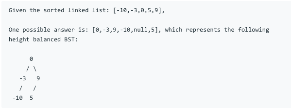

# 问题：109
# Problem: [Convert Sorted List to Binary Search Tree](https://leetcode.com/problems/convert-sorted-list-to-binary-search-tree/)

## 描述 Description
> Given a singly linked list where elements are sorted in ascending order, convert it to a height balanced BST.

> For this problem, a height-balanced binary tree is defined as a binary tree in which the depth of the two subtrees of every node never differ by more than 1.


## 例子 Example
 
> 


## 分析 Analysis

核心思想：这道题有多种解法，可以用recursive解，也可以把linked list 转化成list后再解。比较巧妙的是用in-order dfs simulation的解法，之前都没有用过。
> 思路1：
>> 时间复杂度：O()
>> 空间复杂度：O()


## 解决方案 Solution
```

```
### 1.Recursive

> 时间复杂度：O(NlogN)
> 空间复杂度：O(N)

### Python


```python
# Definition for singly-linked list.
# class ListNode:
#     def __init__(self, x):
#         self.val = x
#         self.next = None

# Definition for a binary tree node.
# class TreeNode:
#     def __init__(self, x):
#         self.val = x
#         self.left = None
#         self.right = None

class Solution:
    def sortedListToBST(self, head: ListNode) -> TreeNode:
        if not head:
            return None
        fast = slow = head
        prev = None
        while fast.next and fast.next.next:
            fast = fast.next.next
            prev = slow
            slow = slow.next
        if prev:
            prev.next = None
        root = TreeNode(slow.val)
        if slow == head:
            root.left = None
        else:
            root.left = self.sortedListToBST(head)
        root.right = self.sortedListToBST(slow.next)
        return root
```

### C++

```c++

```


### 2. In-order DFS simulation


> 时间复杂度：O(N)
> 空间复杂度：O(N)

### Python


```python
# Definition for singly-linked list.
# class ListNode:
#     def __init__(self, x):
#         self.val = x
#         self.next = None

# Definition for a binary tree node.
# class TreeNode:
#     def __init__(self, x):
#         self.val = x
#         self.left = None
#         self.right = None

class Solution:
    def sortedListToBST(self, head: ListNode) -> TreeNode:
        if not head:
            return None
        # find the size of list node
        size = 0
        p = head
        while p:
            p = p.next
            size += 1
        
        # inorder dfs simulation
        def dfs(l, r):
            nonlocal head
            if l > r:
                return None
            mid = (l + r) // 2
            left = dfs(l, mid - 1)
            node = TreeNode(head.val)
            head = head.next
            right = dfs(mid + 1, r)
            node.left = left
            node.right = right
            return node
        
        return dfs(0, size - 1)
```

### C++

```c++

```


## 总结

### 1.看到这个问题，我最初是怎么思考的？我是怎么做的？遇到了哪些问题？
一开始想到的就是转化成list，然后用recursive解，后来想出来直接在linked list上用recursive解。
### 2.别人是怎么思考的？别人是怎么做的？
没想到的就是DFS simulation，这个解法太巧妙了。利用l,r来控制递归到哪一层。我不是没想过这种方法，只是不知道该怎么控制递归。这种逆向方法很多地方都可以用。

### 3.与他的做法相比，我有哪些可以提升的地方？


```python

```
