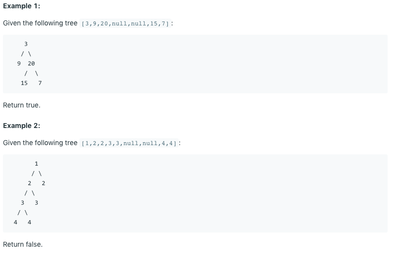

# 问题：110
# Problem: [Balanced Binary Tree](https://leetcode.com/problems/balanced-binary-tree/)

## 描述 Description
>Given a binary tree, determine if it is height-balanced.

>For this problem, a height-balanced binary tree is defined as:

>a binary tree in which the depth of the two subtrees of every node never differ by more than 1.

## 例子 Example
### Example 1




## 分析 Analysis

核心思想：
> 思路1：This is a DFS problem, use recursive approach
>> 时间复杂度：O(n)
>> 空间复杂度：O(n)


## 定义 Definition

### Python


```python


```

### C++

```c++

```


## 解决方案 Solution
```

```
### 1.

> 时间复杂度：O(nlogn)
> 空间复杂度：O(n)

### Python


```python
# Definition for a binary tree node.
# class TreeNode:
#     def __init__(self, x):
#         self.val = x
#         self.left = None
#         self.right = None

class Solution:
    def isBalanced(self, root) -> bool:
```

### C++

```c++

```


### 2.

> 时间复杂度：O()
> 空间复杂度：O()

### Python


```python
# Definition for a binary tree node.
# class TreeNode:
#     def __init__(self, x):
#         self.val = x
#         self.left = None
#         self.right = None

class Solution:
    def isBalanced(self, root) -> bool:
        return self.helper(root)[1]
        
    def helper(self, root):
        if root is None:
            return 0,True # depth and isBalanced
        left = self.helper(root.left)
        right = self.helper(root.right)
        if left[1] == False or right[1] == False or abs(left[0]-right[0]) > 1:
            return max(left[0],right[0]) + 1, False
        else:
            return max(left[0], right[0]) + 1, True

```

### C++

```c++

```


## 总结

### 1.看到这个问题，我最初是怎么思考的？我是怎么做的？遇到了哪些问题？


### 2.别人是怎么思考的？别人是怎么做的？


### 3.与他的做法相比，我有哪些可以提升的地方？


```python

```
