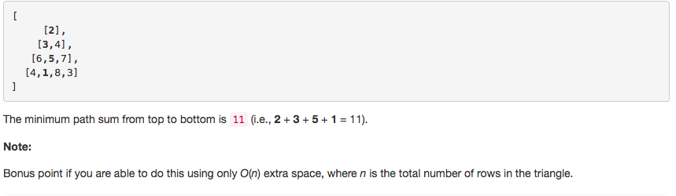

# 问题：120
# Problem: [Triangle](https://leetcode.com/problems/triangle/description/)

## 描述 Description
> ### Given a triangle, find the minimum path sum from top to bottom. Each step you may move to adjacent numbers on the row below.

For example, given the following triangle

> ### 

## 例子 Example
### Example 1

> 


## 分析 Analysis

核心思想：
> 思路1：这道题一看起来很想树结构，会想着用DFS或者BFS去解。用树结构遇到的问题就是子树有重叠部分，用递归会被重复计算。要避免被重复计算，可以用Dynamic Programming。
>> 时间复杂度：O(n)
>> 空间复杂度：O(n)


## 定义 Definition

### Python


```python
class Solution:
    def minimumTotal(self, triangle: List[List[int]]) -> int:

```

### C++

```c++

```


## 解决方案 Solution
```
用DP解题，分四个步骤
1. state function
2. initialization
3. update function
4. final result

把这四步想清楚就行
```
### 1.

> 时间复杂度：O(n)
> 空间复杂度：O(n)

### Python


```python
class Solution:
    def minimumTotal(self, triangle: List[List[int]]) -> int:
    # Solution 1, DP, top-down
        # 1. state function s[i] represent the minimum total ending with r[j][i], 0 <= j < len(triangle)
        # 2. initialization s[0] = triangle[0][0]
        # 3. update function , update backforward
        #   if i = 0 , s[i] = row[i] + s[i]
        #   elif i = len(row) - 1, s.append(s[i-1]+row[i])
        #   else s[i] = min(s[i-1],s[i]) + row[i]
        # 4. Result: 
        # min(s)
        
        # input control
        if len(triangle) == 0 or len(triangle[0]) == 0:
            return 0
        # state function and initialization
        s = [triangle[0][0]]
        for row in triangle[1:]:
            for i in range(len(row)-1, -1, -1):
                if i == 0:
                    s[i] += row[i]
                elif i == len(row) - 1:
                    s.append(s[i-1]+row[i])
                else:
                    s[i] = min(s[i-1],s[i]) + row[i]
            #print(s)
        return min(s)

```

### C++

```c++

```


### 2.

> 时间复杂度：O(n)
> 空间复杂度：O(n)

### Python


```python
class Solution:
    def minimumTotal(self, triangle: List[List[int]]) -> int:
    # Solution 2, DP, bottom-up
        if len(triangle) == 0 or len(triangle[0]) == 0:
            return 0
        s = triangle[-1]
        for r in range(len(triangle)-2, -1, -1):
            for i,val in enumerate(triangle[r]):
                s[i] = min(s[i], s[i+1]) + val
        return s[0]
```

### C++

```c++

```


## 总结

### 1.看到这个问题，我最初是怎么思考的？我是怎么做的？遇到了哪些问题？
遇到这道问题很快就想到了用DP，做得也很快，唯一的问题就是update function update的顺序没考虑清楚，在top-down的解法中要从后往前

### 2.别人是怎么思考的？别人是怎么做的？
别人的答案用的是bottom-up的方法，要简洁的多，以后注意反向思维，可以top-down,难道就不能bottom-up，能从左到右，难道就不能从右到左。

### 3.与他的做法相比，我有哪些可以提升的地方？

DP的本质是减少循环和重复计算次数，用空间换取时间。
这些问题可以用到DP：  
  1. 找最大/最小  
  2. Yes/No  
  3. Count  

  DP问题的最大难点在于对state function的构造，以及如何update。

  


```python

```
