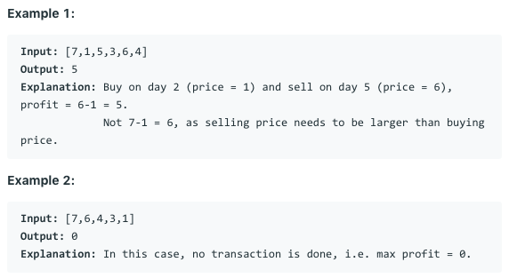

# 问题：121
# Problem: [Best Time to Buy and Sell Stock](https://leetcode.com/problems/best-time-to-buy-and-sell-stock/)

## 描述 Description
> Say you have an array for which the ith element is the price of a given stock on day i.

> If you were only permitted to complete at most one transaction (i.e., buy one and sell one share of the stock), design an algorithm to find the maximum profit.

> Note that you cannot sell a stock before you buy one.


## 例子 Example

> 


## 分析 Analysis

核心思想：
Dynamic programming. Use two state variable to store the profit state after buy or after sell. Initialize buy variable with negative infinity.
> 思路1：
>> 时间复杂度：O(n)
>> 空间复杂度：O(1)


## 解决方案 Solution
```

```
### 1.

> 时间复杂度：O(n)
> 空间复杂度：O(1)

### Python


```python
class Solution:
    def maxProfit(self, prices: List[int]) -> int:
        # input control
        if not prices:
            return 0
        buy = float('-Inf')  # profit after buy
        sell = 0  # profit after sell
        for price in prices:
            sell = max(sell, buy + price)
            buy = max(buy, -price)
        return sell  
```

### C++

```c++

```


### 2.

> 时间复杂度：O()
> 空间复杂度：O()

### Python


```python

```

### C++

```c++

```


## 总结

### 1.看到这个问题，我最初是怎么思考的？我是怎么做的？遇到了哪些问题？


### 2.别人是怎么思考的？别人是怎么做的？


### 3.与他的做法相比，我有哪些可以提升的地方？
Dynamic programming. Use two state variable to store the profit state after buy or after sell. Initialize buy variable with negative infinity. Stock 类问题的模板。


```python

```
