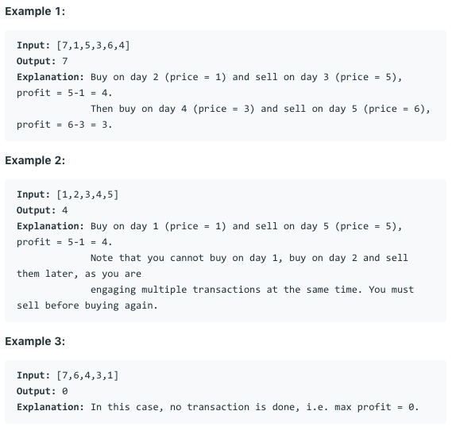

# 问题：122
# Problem: [Best Time to Buy and Sell Stock II](https://leetcode.com/problems/best-time-to-buy-and-sell-stock-ii/)

## 描述 Description
> Say you have an array for which the ith element is the price of a given stock on day i.

> Design an algorithm to find the maximum profit. You may complete as many transactions as you like (i.e., buy one and sell one share of the stock multiple times).

> Note: You may not engage in multiple transactions at the same time (i.e., you must sell the stock before you buy again).


## 例子 Example


> 


## 分析 Analysis

核心思想：
> 思路1：
>> 时间复杂度：O()
>> 空间复杂度：O()


## 解决方案 Solution
```

```
### 1.

DP problem
> 时间复杂度：O()
> 空间复杂度：O()

### Python


```python
class Solution:
    def maxProfit(self, prices: List[int]) -> int:
        # input control
        if not prices:
            return 0
        buy = float('-Inf')
        sell = 0
        for price in prices:
            sell += max(0, price + buy)
            buy = -price
        return sell

```

### C++

```c++

```


### 2.

> 时间复杂度：O()
> 空间复杂度：O()

### Python


```python

```

### C++

```c++

```


## 总结

### 1.看到这个问题，我最初是怎么思考的？我是怎么做的？遇到了哪些问题？


### 2.别人是怎么思考的？别人是怎么做的？


### 3.与他的做法相比，我有哪些可以提升的地方？


```python

```
