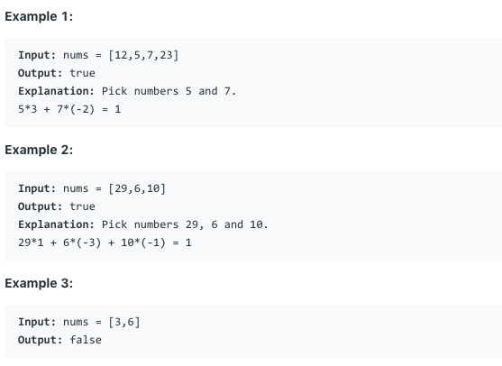

# 问题：1250
# Problem: [Check If It Is a Good Array](https://leetcode.com/problems/check-if-it-is-a-good-array/)

## 描述 Description
>  Given an array nums of positive integers. Your task is to select some subset of nums, multiply each element by an integer and add all these numbers. The array is said to be good if you can obtain a sum of 1 from the array by any possible subset and multiplicand.

> Return True if the array is good otherwise return False.


## 例子 Example
 
> 


## 分析 Analysis

核心思想：
> 思路1：
>> 时间复杂度：O(N)
>> 空间复杂度：O(1)


## 解决方案 Solution
```
使用辗转相除法求最大公因子
```
### 1.

> 时间复杂度：O(N)
> 空间复杂度：O(1)

### Python


```python
class Solution:
    def isGoodArray(self, nums: List[int]) -> bool:
        gcd = nums[0]
        for a in nums:
            while a:
                gcd, a = a, gcd % a
            if gcd == 1:
            		return True
        return False
```

### C++

```c++

```


### 2.

> 时间复杂度：O()
> 空间复杂度：O()

### Python


```python

```

### C++

```c++

```


## 总结

### 1.看到这个问题，我最初是怎么思考的？我是怎么做的？遇到了哪些问题？
想到了求最大公约数GCD,忘记了辗转相除法。

### 2.别人是怎么思考的？别人是怎么做的？


### 3.与他的做法相比，我有哪些可以提升的地方？


```python

```
