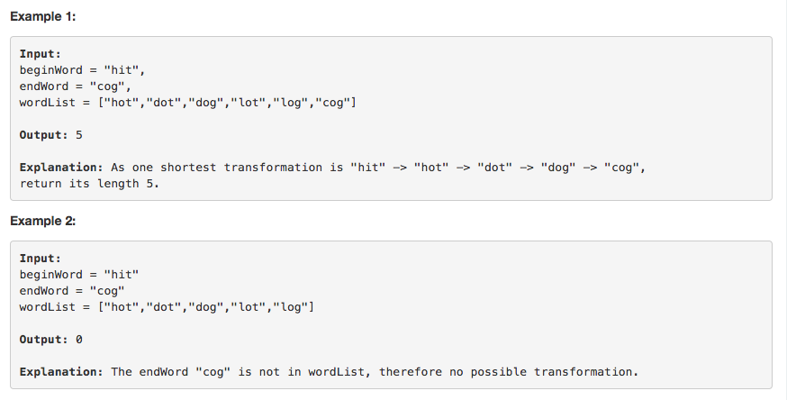

# 问题：127
# Problem: [Word Ladder](https://leetcode.com/problems/word-ladder/description/)

## 描述 Description
> ### Given two words (beginWord and endWord), and a dictionary's word list, find the length of shortest transformation sequence from beginWord to endWord, such that:

Only one letter can be changed at a time.
Each transformed word must exist in the word list. Note that beginWord is not a transformed word.
Note:

Return 0 if there is no such transformation sequence.
All words have the same length.
All words contain only lowercase alphabetic characters.
You may assume no duplicates in the word list.
You may assume beginWord and endWord are non-empty and are not the same.

> ### 

## 例子 Example
### Example 1

> 


## 分析 Analysis

核心思想：
> 思路1：This is a BFS problem
>> 时间复杂度：O(mn)
>> 空间复杂度：O(mn)


## 定义 Definition

### Python


```python
class Solution:
    def ladderLength(self, beginWord: str, endWord: str, wordList: List[str]) -> int:

```

### C++

```c++

```


## 解决方案 Solution
```

```
### 1.

> 时间复杂度：O(mn)
> 空间复杂度：O(mn)

### Python


```python
class Solution:
    def ladderLength(self, beginWord: str, endWord: str, wordList: List[str]) -> int:
        # The only problem is how to find the neighbor word, use regular express
        if beginWord == None or endWord == None or len(wordList)  < 1 or endWord == beginWord or endWord not in wordList:
            return 0
        # save the general pattern of each word
        pattern = collections.defaultdict(list)
        L = len(beginWord)
        for word in wordList:
            for i in range(L):
                pattern[word[:i]+'.'+word[i+1:]].append(word)

        queue = collections.deque([beginWord])
        visited = {beginWord}
        level = 1
        while queue:
            size = len(queue)
            level += 1
            for _ in  range(size):
                cur = queue.popleft()
                for j in range(L):
                    for word in pattern[cur[:j]+'.'+cur[j+1:]]:
                        if word == endWord:
                            return level
                        elif word not in visited:
                            queue.append(word)
                            visited.add(word)
        return 0
```

### C++

```c++

```


### 2.

> 时间复杂度：O()
> 空间复杂度：O()

### Python


```python

```

### C++

```c++

```


## 总结

### 1.看到这个问题，我最初是怎么思考的？我是怎么做的？遇到了哪些问题？
这题是典型的找最小路径问题，一开始就想到用BFS，但是时间一直溢出，原因在于没有使用dictionary
### 2.别人是怎么思考的？别人是怎么做的？


### 3.与他的做法相比，我有哪些可以提升的地方？

利用空间换取时间，先把pattern存储起来，能节省不少时间。

```python

```
