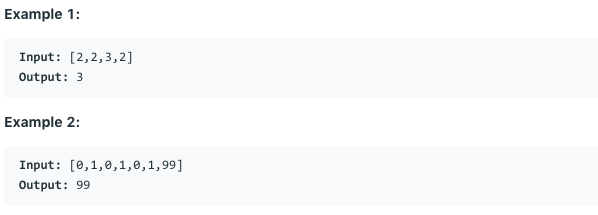

# 问题：137
# Problem: [Single Number II](https://leetcode.com/problems/single-number-ii/)

## 描述 Description
> Given a non-empty array of integers, every element appears three times except for one, which appears exactly once. Find that single one.

> Note:

> Your algorithm should have a linear runtime complexity. Could you implement it without using extra memory? 


## 例子 Example
 
> 


## 分析 Analysis

核心思想：
> 思路1：
>> 时间复杂度：O()
>> 空间复杂度：O()


## 解决方案 Solution
```

```
### 1. XOR

> 时间复杂度：O(n)
> 空间复杂度：O(1)

### Python


```python
class Solution:
    def singleNumber(self, nums: List[int]) -> int:
        one = two = 0
        for num in nums:
            one = one ^ num & ~two
            two = two ^ num & ~one
        return one
```

### C++

```c++

```


### 2.

> 时间复杂度：O()
> 空间复杂度：O()

### Python


```python

```

### C++

```c++

```


## 总结

### 1.看到这个问题，我最初是怎么思考的？我是怎么做的？遇到了哪些问题？


### 2.别人是怎么思考的？别人是怎么做的？


### 3.与他的做法相比，我有哪些可以提升的地方？


```python

```
