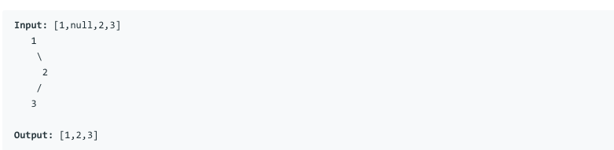

# 问题：144
# Problem: [Binary Tree Preorder Traversal](https://leetcode.com/problems/binary-tree-preorder-traversal/)

## 描述 Description
> 
Given a binary tree, return the preorder traversal of its nodes' values.

> ### 

## 例子 Example
### Example 1

> 


## 分析 Analysis

核心思想：
> 思路1：This is a DFS problem, use recursive approach
>> 时间复杂度：O(n)
>> 空间复杂度：O(n)


## 定义 Definition

### Python


```python


```

### C++

```c++

```


## 解决方案 Solution
```

```
### 1.

> 时间复杂度：O(n)
> 空间复杂度：O(n)

### Python


```python
# Definition for a binary tree node.
# class TreeNode:
#     def __init__(self, x):
#         self.val = x
#         self.left = None
#         self.right = None

class Solution:
    def preorderTraversal(self, root: TreeNode) -> List[int]:
        if root is None:
            return []
        ans = []
        stack = collections.deque()
        p = root
        while p or stack:
            if p:
                ans.append(p.val)
                stack.append(p)
                p = p.left
            else:
                p = stack.pop()
                p = p.right
        return ans
            
        
    
        
```

### C++

```c++

```


### 2.

> 时间复杂度：O()
> 空间复杂度：O()

### Python


```python

```

### C++

```c++

```


## 总结

### 1.看到这个问题，我最初是怎么思考的？我是怎么做的？遇到了哪些问题？


### 2.别人是怎么思考的？别人是怎么做的？


### 3.与他的做法相比，我有哪些可以提升的地方？


```python

```
