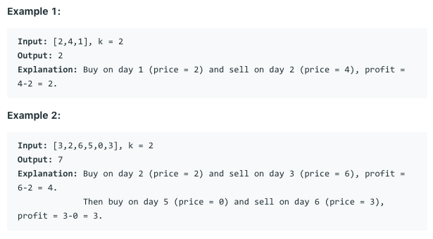

# 问题：188
# Problem: [Best Time to Buy and Sell Stock IV](https://leetcode.com/problems/best-time-to-buy-and-sell-stock-iv/)

## 描述 Description
>  Say you have an array for which the i-th element is the price of a given stock on day i.

> Design an algorithm to find the maximum profit. You may complete at most k transactions.

> Note:
> You may not engage in multiple transactions at the same time (ie, you must sell the stock before you buy again).


## 例子 Example
 
> 


## 分析 Analysis

核心思想：用DP，存两种状态，buy/ sell
> 思路1：
>> 时间复杂度：O()
>> 空间复杂度：O()


## 解决方案 Solution
```

```
### 1.

> 时间复杂度：O(n*k)
> 空间复杂度：O(k)

### Python


```python
class Solution(object):
    def maxProfit(self, k, prices):
        """
        :type k: int
        :type prices: List[int]
        :rtype: int
        """
        # use DP
        # simple case, trade any time
        if k > len(prices) // 2:
            res = 0
            for i in range(1, len(prices)):
                res += max(prices[i] - prices[i-1], 0)
            return res
        
        # k is limited
        sells = [0] * (k + 1)
        buys = [float('-Inf')] * (k + 1)
        for j, price in enumerate(prices):
            for i in range(1, min(j + 2, k + 1)):
                sells[i] = max(sells[i], buys[i] + price)
                buys[i] = max(buys[i], sells[i-1] - price)
        return max(sells)
```

### C++

```c++

```


### 2.

> 时间复杂度：O()
> 空间复杂度：O()

### Python


```python

```

### C++

```c++

```


## 总结

### 1.看到这个问题，我最初是怎么思考的？我是怎么做的？遇到了哪些问题？
一开始就想到了用动规，submit时遇到一个k=1000000的例子，时间溢出。通过时间复杂度分析，该解法的复杂度是O(n*k)，而且最优算法的时间复杂度不可能小于O(n)。符合要求的有O(n), O(nlogk), O(n + k)，怎么优化到logK的复杂度？heap是logk的复杂度，还有就是binary search，这里明显不适合binary search。那就是heap，问题是heap怎么用？用heap要避免重复片段，比如【1，4，3，5】，有三个值，交易一次： 3 ， 2， 4，交易两次 5. 如果用heap，怎么避免把5加入heap的同时，不把4加入heap。发现用heap也不行。最后看了一下自己以前的答案，才知道该把K值特别大的特殊处理。

### 2.别人是怎么思考的？别人是怎么做的？


### 3.与他的做法相比，我有哪些可以提升的地方？


```python

```
