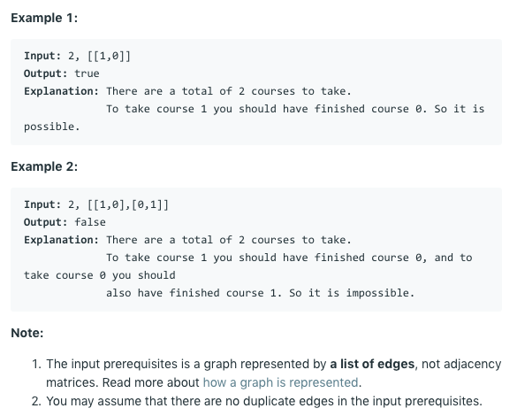

# 问题：207
# Problem: [Course Schedule](https://leetcode.com/problems/course-schedule/)

## 描述 Description
> There are a total of n courses you have to take, labeled from 0 to n-1.

> Some courses may have prerequisites, for example to take course 0 you have to first take course 1, which is expressed as a pair: [0,1]

> Given the total number of courses and a list of prerequisite pairs, is it possible for you to finish all courses?


## 例子 Example

> 


## 分析 Analysis

核心思想：Topological Sort with BFS  
BFS Template:  
1. Convert to adjancency list
2. Count the in degree for each node    
3. Create a toVisit queue  
4. Visit all toVisit nodes, elimiate the connected edge from toVisit node, and add the 0 in degree node to the toVisit list    
5. Count the number of visited node  
> 思路1：
>> 时间复杂度：O(N + E), E is edge number, N is node number
>> 空间复杂度：O(N)


## 解决方案 Solution
```

```
### 1.

> 时间复杂度：O(N + E)
> 空间复杂度：O(N)

### Python


```python
class Solution:
    def canFinish(self, numCourses: int, prerequisites: List[List[int]]) -> bool:
        if numCourses < 0:
            return 0
        
        # create a adjacency list
        adjList = [[] for _ in range(numCourses)]
        inDegree = [0] * numCourses
        for dest,src in prerequisites:
            adjList[src].append(dest)
            inDegree[dest] += 1
            
        # BFS
        toVisit = collections.deque()
        for i,n in enumerate(inDegree):
            if n == 0:
                toVisit.append(i)
        
        visited = 0
        while toVisit:
            node = toVisit.popleft()
            visited += 1
            for nei in adjList[node]:
                inDegree[nei] -= 1
                if inDegree[nei] == 0:
                    toVisit.append(nei)
        
        return visited == numCourses
            
      
```

### C++

```c++

```


### 2.

> 时间复杂度：O()
> 空间复杂度：O()

### Python


```python

```

### C++

```c++

```


## 总结

### 1.看到这个问题，我最初是怎么思考的？我是怎么做的？遇到了哪些问题？


### 2.别人是怎么思考的？别人是怎么做的？


### 3.与他的做法相比，我有哪些可以提升的地方？
模板


```python

```
