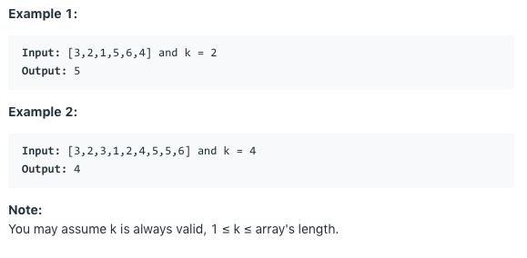

# 问题：215
# Problem: [Kth Largest Element in an Array](https://leetcode.com/problems/kth-largest-element-in-an-array/)

## 描述 Description
> Find the kth largest element in an unsorted array. Note that it is the kth largest element in the sorted order, not the kth distinct element.


## 例子 Example
### Example 1

> 


## 分析 Analysis

核心思想：
> 思路1：
>> 时间复杂度：O()
>> 空间复杂度：O()


## 解决方案 Solution
```

```
### 1.

use heap
> 时间复杂度：O(NlogK)
> 空间复杂度：O(K)

### Python


```python
class Solution:
    def findKthLargest(self, nums: List[int], k: int) -> int:
            return heapq.nlargest(k, nums)[-1]
```

### C++

```c++

```


### 2.

> 时间复杂度：O(N)
> 空间复杂度：O(N^2)

### Python


```python
class Solution:
    def findKthLargest(self, nums: List[int], k: int) -> int:
        # solution 2, divide and conquer (quick sort)
        if not nums or k < 1:
            return None
        
        self.helper(nums, 0, len(nums)-1, k)
        return nums[k-1]
    
    def helper(self, nums, start, end, k):
        # ending condition
        if start >= end:
            return
        # partition
        pivot = nums[start]
        left, right = start + 1, end
        while left <= right:
            while left <= right and nums[left] >= pivot:
                left += 1
            while right >= left and nums[right] < pivot:
                right -= 1
            if left <= right:
                tmp = nums[left]
                nums[left] = nums[right]
                nums[right] = tmp
        nums[start] = nums[left-1]
        nums[left-1] = pivot
        
        # divide
        offset = left - start - k
        if offset > 0 :     # target on the left part
            self.helper(nums, start, left-2, k)
        elif offset < 0:    # target on the right part
            self.helper(nums, left, end, -offset)
        # target is pivot
        return
        
        
            
        
```

### C++

```c++

```


## 总结

### 1.看到这个问题，我最初是怎么思考的？我是怎么做的？遇到了哪些问题？


### 2.别人是怎么思考的？别人是怎么做的？


### 3.与他的做法相比，我有哪些可以提升的地方？


可以直接用heapq.nlargest(k, nums)[-1] 实现

```python

```
