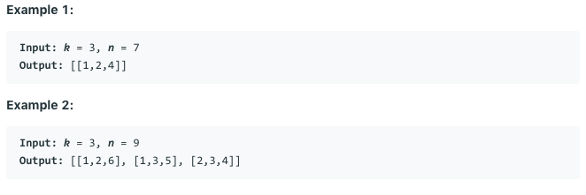

# 问题：216
# Problem: [Combination Sum III](https://leetcode.com/problems/combination-sum-iii/)

## 描述 Description
> Find all possible combinations of k numbers that add up to a number n, given that only numbers from 1 to 9 can be used and each combination should be a unique set of numbers.

Note:

All numbers will be positive integers.
The solution set must not contain duplicate combinations.

> ### 

## 例子 Example
### Example 1

> 


## 分析 Analysis

核心思想：
> 思路1：Backtracking problem
>> 时间复杂度：O()
>> 空间复杂度：O()


## 解决方案 Solution
```

```
### 1.

> 时间复杂度：O()
> 空间复杂度：O()

### Python


```python
class Solution:
    def combinationSum3(self, k: int, n: int) -> List[List[int]]:
        # backtrack problem
        if k <= 0 or n <= 0:
            return [[]]
        self.res = []
        self.backtrack(k, n, [], 1)
        return self.res
    
    def backtrack(self, k, n, cur, num):
        if k == 0 and n == 0:
            self.res.append(cur)
            return
        elif k == 0 or n <= 0:
            return
        for i in range(num, 10):
            if i > n:
                break
            self.backtrack(k-1, n-i, cur+[i], i+1)
        return    
            
        
```

### C++

```c++

```


### 2.

> 时间复杂度：O()
> 空间复杂度：O()

### Python


```python

```

### C++

```c++

```


## 总结

### 1.看到这个问题，我最初是怎么思考的？我是怎么做的？遇到了哪些问题？


### 2.别人是怎么思考的？别人是怎么做的？


### 3.与他的做法相比，我有哪些可以提升的地方？


```python

```
