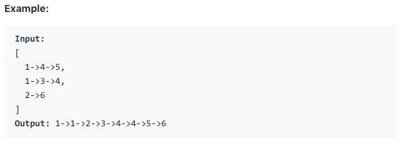

# 问题：23
# Problem: [Merge k sorted lists](https://leetcode.com/problems/merge-k-sorted-lists/)

## 描述 Description
> Merge k sorted linked lists and return it as one sorted list. Analyze and describe its complexity.


> ### 

## 例子 Example

> 

## 分析 Analysis

核心思想：
> 思路1：
>> 时间复杂度：O()
>> 空间复杂度：O()


## 解决方案 Solution
```

```
### 1.

> 时间复杂度：O(NlogK)
> 空间复杂度：O()

### Python


```python
# Definition for singly-linked list.
# class ListNode:
#     def __init__(self, x):
#         self.val = x
#         self.next = None

class Solution:
    def mergeKLists(self, lists: List[ListNode]) -> ListNode:
        # divide and conquer
        if not lists:
            return None
        return self.helper(lists, 0, len(lists)-1)
    
    def helper(self, lists, start, end):
        if start == end:
            return lists[start]
        mid = (end + start) // 2
        left = self.helper(lists, start, mid)
        right = self.helper(lists, mid+1, end)
        return self.merge(left, right)
        
        
    def merge(self, l1, l2):
        p = header = ListNode(None)
        while l1 or l2:
            v1 = l1.val if l1 else float('Inf')
            v2 = l2.val if l2 else float('Inf')
            if v1 <= v2:
                p.next = l1
                l1 = l1.next
            else:
                p.next = l2
                l2 = l2.next
            p = p.next
        return header.next
        
```

### C++

```c++

```


### 2.

> 时间复杂度：O()
> 空间复杂度：O()

### Python


```python

```

### C++

```c++

```


## 总结

### 1.看到这个问题，我最初是怎么思考的？我是怎么做的？遇到了哪些问题？


### 2.别人是怎么思考的？别人是怎么做的？


### 3.与他的做法相比，我有哪些可以提升的地方？


```python

```
