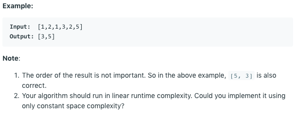

# 问题：260
# Problem: [Single Number III](https://leetcode.com/problems/single-number-iii/)

## 描述 Description
> Given an array of numbers nums, in which exactly two elements appear only once and all the other elements appear exactly twice. Find the two elements that appear only once.


## 例子 Example
 
> 


## 分析 Analysis

核心思想：
> 思路1：
>> 时间复杂度：O()
>> 空间复杂度：O()


## 解决方案 Solution
```

```
### 1.

> 时间复杂度：O(n)
> 空间复杂度：O(1)

### Python

```python
class Solution:
    def singleNumber(self, nums: List[int]) -> List[int]:
        # bit manipulation
        xor = 0
        for num in nums:
            xor ^= num
        # for the xor result, for example 101, means the one of 
        # the number has bit 1 at position 0,
        # and the other number has bit 0 at position 0
        xor &= -xor
        one = two = 0
        for num in nums:
            if xor & num == 0:
                one ^= num
            else:
                two ^= num
        return [one, two]
```

### C++

```c++

```


### 2.

> 时间复杂度：O()
> 空间复杂度：O()

### Python


```python

```

### C++

```c++

```


## 总结

### 1.看到这个问题，我最初是怎么思考的？我是怎么做的？遇到了哪些问题？


### 2.别人是怎么思考的？别人是怎么做的？


### 3.与他的做法相比，我有哪些可以提升的地方？


```python

```
