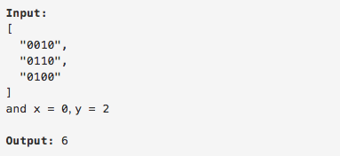

# 问题：302
# Problem: [Smallest Rectangle Enclosing Black Pixels](https://leetcode.com/problems/smallest-rectangle-enclosing-black-pixels/description/)

## 描述 Description
> ### https://leetcode.com/problems/smallest-rectangle-enclosing-black-pixels/description/

> ### 

## 例子 Example
### Example 1

> 


## 分析 Analysis

核心思想：
> 思路1：这题可以直接遍历矩阵找边界，那样的时间复杂度就是O（n^2),也可以用DFS搜索，时间复杂度也是O（n^2），而且还会有递归深度过大，栈溢出的问题。最好的方法是用Binary search。
>> 时间复杂度：O(mlogn) + O(nlogm)
>> 空间复杂度：O(1)


## 定义 Definition

### Python


```python
class Solution:
    def minArea(self, image: List[List[str]], x: int, y: int) -> int:

```

### C++

```c++

```


## 解决方案 Solution
```

```
### 1.
Brute-force
> 时间复杂度：O(n^2)
> 空间复杂度：O(1)

### Python


```python
class Solution:
    def minArea(self, image: List[List[str]], x: int, y: int) -> int:
#         # Solution 1, brute-force search
#         # the time complexity is O(mn)        
#         # input control
        if len(image) == 0 or len(image[0]) == 0 or x < 0 or y < 0:
            return 0
        m,n = len(image), len(image[0])
        boundary = [x,x,y,y]# row_min, row_max, col_min, col_max
        
        for r in range(m):
            for c in range(n):
                #print("r={},c={}".format(r,c))
                if image[r][c] == '1':
                    boundary[0] = min(boundary[0], r)
                    boundary[1] = max(boundary[1], r)
                    boundary[2] = min(boundary[2], c)
                    boundary[3] = max(boundary[3], c)
        return (boundary[1] - boundary[0] + 1) * (boundary[3] - boundary[2] + 1)
```

### C++

```c++

```


### 2.
Binary Search
> 时间复杂度：O(nlogm) + O(mlogn)
> 空间复杂度：O(1)

### Python


```python
class Solution:
    def minArea(self, image: List[List[str]], x: int, y: int) -> int:
        # Solution 2, Binary search
        # Time complexity O(mlogn) + O(nlogm)
        # input control
        if len(image) == 0 or len(image[0]) == 0 or x < 0 or y < 0:
            return 0
        m,n = len(image), len(image[0])
        left = self.helper(image, 0, y, 0, m, True, True)
        right = self.helper(image, y + 1, n, 0, m, True, False)
        top =  self.helper(image, 0, x, left, right, False, True)
        bottom = self.helper(image, x + 1, m, left, right, False, False)
        
        return (right - left) * (bottom - top)
        
    def helper(self,image, i, j, start, end, isSearchCol, findLow):
        while i < j:
            k,mid = start, (i + j) // 2
            if isSearchCol:
                while k < end and image[k][mid] == '0':
                    k += 1
            else:
                while k < end and image[mid][k] == '0':
                    k += 1
            if (k < end) == findLow:
                j = mid
            else:
                i = mid + 1
                
        return i
```

### C++

```c++

```


## 总结

### 1.看到这个问题，我最初是怎么思考的？我是怎么做的？遇到了哪些问题？

一开始就想到了遍历整个矩阵的方法，也很快就编译通过了。后来一直尝试了用DFT解，遇到递归栈溢出的问题。也想到了用binary search来做，当时的想法是用binary search找出每一行的最左边black pixel和最右边的black pixel，发现这样做最坏情况下复杂度还是O(mn)。然后就不知道该怎么办了。

### 2.别人是怎么思考的？别人是怎么做的？
这道题是看了答案才学会的。没想到需要用binary search分别找四个方向

### 3.与他的做法相比，我有哪些可以提升的地方？

边界条件还是容易做错，需要多考虑些。

```python

```
