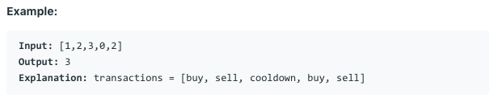

# 问题：309
# Problem: [Best Time to Buy and Sell Stock with Cooldown](https://leetcode.com/problems/best-time-to-buy-and-sell-stock-with-cooldown/)

## 描述 Description
> Say you have an array for which the ith element is the price of a given stock on day i.

> Design an algorithm to find the maximum profit. You may complete as many transactions as you like (ie, buy one and sell one share of the stock multiple times) with the following restrictions:

> You may not engage in multiple transactions at the same time (ie, you must sell the stock before you buy again).
> After you sell your stock, you cannot buy stock on next day. (ie, cooldown 1 day)


## 例子 Example
 
> 


## 分析 Analysis

核心思想：DP,分别存下buy, cooldown, sell
> 思路1：
>> 时间复杂度：O(n)
>> 空间复杂度：O()


## 解决方案 Solution
```

```
### 1.

> 时间复杂度：O()
> 空间复杂度：O()

### Python


```python
class Solution(object):
    def maxProfit(self, prices):
        """
        :type prices: List[int]
        :rtype: int
        """
        # input control
        if not prices:
            return 0
        # initialize state variables
        buy, sell, cd = float("-Inf"), 0, 0
        for price in prices:
            buy, cd, sell = max(buy, cd - price), sell, max(sell, buy + price)
        return sell
```

### C++

```c++

```


### 2.

> 时间复杂度：O()
> 空间复杂度：O()

### Python


```python

```

### C++

```c++

```


## 总结

### 1.看到这个问题，我最初是怎么思考的？我是怎么做的？遇到了哪些问题？
一开始没有同时update buy， cooldown, 和sell，出了问题。buy, cooldown, sell表示的意思是如果当前是buy， cooldown, sell状态下，最大的收益是多少。那buy肯定要基于之前的cooldown，cooldown要基于之前的sell, sell要基于之前的buy，所以要同时更新。

### 2.别人是怎么思考的？别人是怎么做的？


### 3.与他的做法相比，我有哪些可以提升的地方？


```python

```
