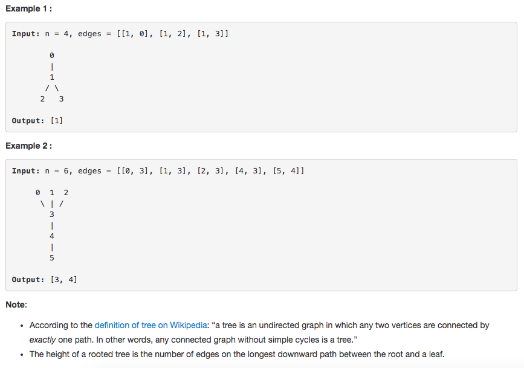

# 问题：310
# Problem: [Minimum Height Trees](https://leetcode.com/problems/minimum-height-trees/description/)

## 描述 Description
> ### For an undirected graph with tree characteristics, we can choose any node as the root. The result graph is then a rooted tree. Among all possible rooted trees, those with minimum height are called minimum height trees (MHTs). Given such a graph, write a function to find all the MHTs and return a list of their root labels.

Format
The graph contains n nodes which are labeled from 0 to n - 1. You will be given the number n and a list of undirected edges (each edge is a pair of labels).

You can assume that no duplicate edges will appear in edges. Since all edges are undirected, [0, 1] is the same as [1, 0] and thus will not appear together in edges.

> ### 

## 例子 Example
### Example 

> 


## 分析 Analysis

核心思想：
> 思路1：This is a BFS problem, 先找到叶节点，从叶节点出发找root。 相当于一层一层修剪，最后剩下的就是root.root最多有两个
>> 时间复杂度：O(nlogn)
>> 空间复杂度：O(n)


## 定义 Definition

### Python


```python
class Solution:
    def findMinHeightTrees(self, n: int, edges: List[List[int]]) -> List[int]:

```

### C++

```c++

```


## 解决方案 Solution
```

```
### 1.

> 时间复杂度：O(nlogn)
> 空间复杂度：O(n)

### Python


```python
class Solution:
    def findMinHeightTrees(self, n: int, edges: List[List[int]]) -> List[int]:
        # BFS, bottom up
        # find all leaves first, then find the nodes have highest depth
        if n < 2 or len(edges) != n - 1:
            return [0]
        # convert to an adjacency table
        adj = [set() for _ in range(n)]
        for edge in edges:
            i,j = edge[0],edge[1]
            adj[i].add(j)
            adj[j].add(i)
        # find all leaves
        leaves = [i for i in range(n) if len(adj[i]) == 1]
        while n > 2: # there are at most two roots
            newLeaves = []
            for leave in leaves: # prune leaves
                branch = adj[leave].pop()
                adj[branch].remove(leave)
                if len(adj[branch]) == 1:
                    newLeaves.append(branch)
            n -= len(leaves) # update tree size after prunning
            leaves = newLeaves # branches become new leaves
        return leaves
```

### C++

```c++

```


### 2.

> 时间复杂度：O()
> 空间复杂度：O()

### Python


```python

```

### C++

```c++

```


## 总结

### 1.看到这个问题，我最初是怎么思考的？我是怎么做的？遇到了哪些问题？
一开始完全没有思路，是看答案做的

### 2.别人是怎么思考的？别人是怎么做的？
用BFS解法太巧妙了。top-down 比较熟，bottom-up的问题经常卡壳，还得多多练习

### 3.与他的做法相比，我有哪些可以提升的地方？

正向思维和逆向思维，遇到问题多想想bottom-up的解法。


```python

```
