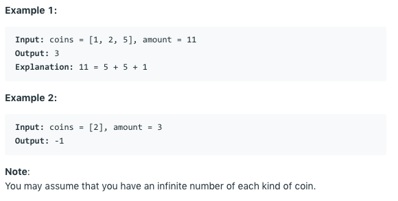

# 问题：322
# Problem: [Coin Change](https://leetcode.com/problems/coin-change/)

## 描述 Description
> You are given coins of different denominations and a total amount of money amount. Write a function to compute the fewest number of coins that you need to make up that amount. If that amount of money cannot be made up by any combination of the coins, return -1.


## 例子 Example

> 


## 分析 Analysis

核心思想：
> 思路1：
>> 时间复杂度：O()
>> 空间复杂度：O()


## 解决方案 Solution
```

```
### 1. DP

> 时间复杂度：O(nk)
> 空间复杂度：O(n)

### Python


```python
class Solution:
    def coinChange(self, coins: List[int], amount: int) -> int:
        # input control
        if not coins:
            return 0
        state = [0] + [float('Inf')] * amount
        for i in range(amount+1):
            if state[i] >= amount:
                continue
            for coin in coins:
                if i + coin <= amount:
                    state[i+coin] = min(state[i+coin], state[i]+1)
        return state[amount] if state[amount] <= amount else -1
```

### C++

```c++

```


### 2.

> 时间复杂度：O()
> 空间复杂度：O()

### Python


```python

```

### C++

```c++

```


## 总结

### 1.看到这个问题，我最初是怎么思考的？我是怎么做的？遇到了哪些问题？


### 2.别人是怎么思考的？别人是怎么做的？


### 3.与他的做法相比，我有哪些可以提升的地方？


```python

```
