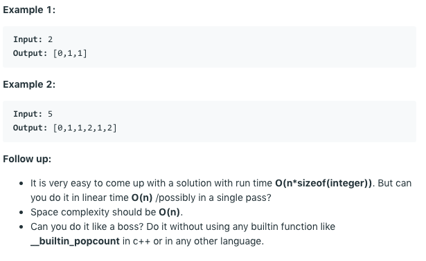

# 问题：338
# Problem: [Counting Bits](https://leetcode.com/problems/counting-bits/)

## 描述 Description
> Given a non negative integer number num. For every numbers i in the range 0 ≤ i ≤ num calculate the number of 1's in their binary representation and return them as an array.


## 例子 Example
 
> 


## 分析 Analysis

核心思想：
> 思路1：bit operation
>> 时间复杂度：O(n)
>> 空间复杂度：O(n)


## 解决方案 Solution
```

```
### 1.

> 时间复杂度：O(n)
> 空间复杂度：O(n)

### Python


```python
class Solution:
    def countBits(self, num: int) -> List[int]:
        # input control
        #if num < 0:
        #    return []
        res = [0 for _ in range(num+1)]
        for i in range(1, num+1):
        	  # solution 1
            #res[i] = res[i >> 1] + (i & 1)
            # solution 2
            res[i] = res[i & (i - 1)] + 1
        return res
```

### C++

```c++

```


### 2.

> 时间复杂度：O()
> 空间复杂度：O()

### Python


```python

```

### C++

```c++

```


## 总结

### 1.看到这个问题，我最初是怎么思考的？我是怎么做的？遇到了哪些问题？


### 2.别人是怎么思考的？别人是怎么做的？


### 3.与他的做法相比，我有哪些可以提升的地方？
Bit manupulation 不熟，看答案才做出来的，求bit number 可以用 i & (i - 1) 的循环，这个比较有意思。


