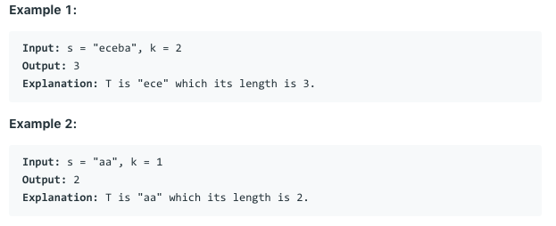

# 问题：340
# Problem: [Longest Substring with At Most K Distinct Characters](https://leetcode.com/problems/longest-substring-with-at-most-k-distinct-characters/)

## 描述 Description
> Given a string, find the length of the longest substring T that contains at most k distinct characters.


## 例子 Example
 
> 


## 分析 Analysis

核心思想：利用Ordered dictionay 减少计算复杂度
> 思路1：
>> 时间复杂度：O(N)
>> 空间复杂度：O(K)


## 解决方案 Solution
```
Dictionary
```
### 1.

> 时间复杂度：O(NK)
> 空间复杂度：O(K)

### Python


```python
class Solution:
    def lengthOfLongestSubstringKDistinct(self, s: str, k: int) -> int:
        if not s or k < 1:
            return 0
        
        left, right = 0, 0
        hashmap = collections.defaultdict(int)
        res = 0
        while right < len(s):
            hashmap[s[right]] = right
            right += 1
            if len(hashmap) == k + 1:
                min_val = min(hashmap.values())
                del hashmap[s[min_val]]
                left = min_val + 1
            res = max(right - left, res)
        return res
```

### C++

```c++

```


### 2. 利用Ordered Dictionary减少计算复杂度

> 时间复杂度：O(N)
> 空间复杂度：O(K)

### Python


```python
class Solution:
    def lengthOfLongestSubstringKDistinct(self, s: str, k: int) -> int:
        if not s or k < 1:
            return 0
        
        left, right = 0, 0
        hashmap = collections.OrderedDict()
        res = 0
        while right < len(s):
            if s[right] in hashmap:
                del hashmap[s[right]]
            hashmap[s[right]] = right
            right += 1
            if len(hashmap) == k + 1:
                a, min_val = hashmap.popitem(last=False)
                left = min_val + 1
            res = max(right - left, res)
        return res
```

### C++

```c++

```


## 总结

### 1.看到这个问题，我最初是怎么思考的？我是怎么做的？遇到了哪些问题？
最初我用的是Bruce force方法，复杂度为O(N^2)，后来有想到sliding window，不知道left boundary该怎么移动，利用dictionary减少复杂度，没想出具体的解法

### 2.别人是怎么思考的？别人是怎么做的？
像substring之类的，通常用sliding window解，难点通常在于怎么移动left 和 right边界。有想到利用dictionary，没想到ordered dictionary

### 3.与他的做法相比，我有哪些可以提升的地方？
需要记住ordered dictionary的用法
od.popitem(last=False)。


```python

```
