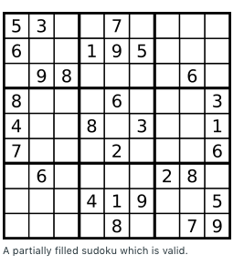
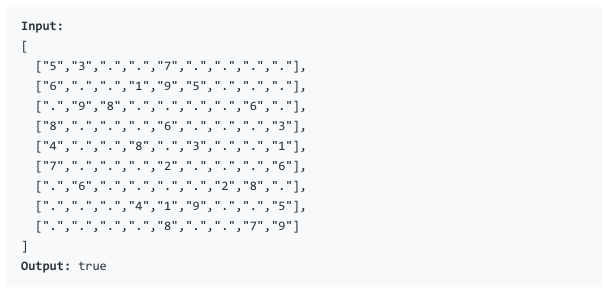
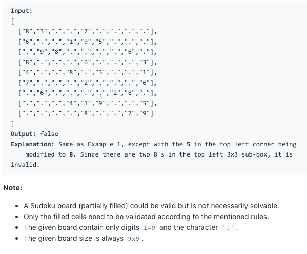

# 问题：36
# Problem: [Valid Sudoku](https://leetcode.com/problems/valid-sudoku/)

## 描述 Description
> Determine if a 9x9 Sudoku board is valid. Only the filled cells need to be validated according to the following rules:

> 1. Each row must contain the digits 1-9 without repetition.
> 2. Each column must contain the digits 1-9 without repetition.
> 3. Each of the 9 3x3 sub-boxes of the grid must contain the digits 1-9 without repetition.  
> 
> The Sudoku board could be partially filled, where empty cells are filled with the character '.'.


## 例子 Example
 
> 

> 
## 分析 Analysis

核心思想：
> 思路1：
>> 时间复杂度：O(N^2)
>> 空间复杂度：O(N^2)


## 解决方案 Solution
```

```
### 1.

> 时间复杂度：O()
> 空间复杂度：O()

### Python


```python
class Solution(object):
    def isValidSudoku(self, board):
        """
        :type board: List[List[str]]
        :rtype: bool
        """
        # input control
        if not board or not board[0]:
            return True
        
        rows = [set() for i in range(9)]
        cols = [set() for i in range(9)]
        boxes = [set() for i in range(9)]
        
        for r in range(9):
            for c in range(9):
                if board[r][c] == '.':
                    continue
                cur = board[r][c]
                if cur in rows[r] or cur in cols[c] or cur in boxes[r//3  * 3+ c//3 ]:
                    return False
                rows[r].add(cur)
                cols[c].add(cur)
                boxes[r//3 * 3 + c//3].add(cur)
        return True
```

### C++

```c++

```


### 2.

> 时间复杂度：O()
> 空间复杂度：O()

### Python


```python

```

### C++

```c++

```


## 总结

### 1.看到这个问题，我最初是怎么思考的？我是怎么做的？遇到了哪些问题？
一开始想到的是分别验证row, col, 和subbox，写得比较复杂，现在这么写就简单多了。


### 2.别人是怎么思考的？别人是怎么做的？


### 3.与他的做法相比，我有哪些可以提升的地方？


```python

```
