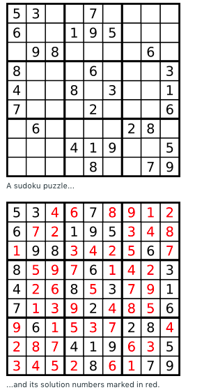

# 问题：37
# Problem: [Sudoku Solver](https://leetcode.com/problems/sudoku-solver/)

## 描述 Description
> Write a program to solve a Sudoku puzzle by filling the empty cells.

> A sudoku solution must satisfy all of the following rules:

> Each of the digits 1-9 must occur exactly once in each row.
> Each of the digits 1-9 must occur exactly once in each column.
> Each of the the digits 1-9 must occur exactly once in each of the 9 3x3 sub-boxes of the grid.
Empty cells are indicated by the character '.'.

> Note:

> The given board contain only digits 1-9 and the character '.'.
You may assume that the given Sudoku puzzle will have a single unique solution.
The given board size is always 9x9.

## 例子 Example
 
> 


## 分析 Analysis

核心思想：backtracking
> 思路1：
>> 时间复杂度：O()
>> 空间复杂度：O()


## 解决方案 Solution
```

```
### 1.

> 时间复杂度：O()
> 空间复杂度：O()

### Python


```python
class Solution(object):
    def solveSudoku(self, board):
        """
        :type board: List[List[str]]
        :rtype: None Do not return anything, modify board in-place instead.
        """
        # input control
        if not board or not board[0]:
            return board
        self.rows = [{board[i][j] for j in range(9) if board[i][j] != '.'} for i in range(9)]
        self.cols = [{board[j][i] for j in range(9) if board[j][i] != '.'} for i in range(9)]
        self.boxes = [{board[i//3 * 3 + j//3][i%3 *3+ j % 3] for j in range(9) if board[i//3 * 3 + j//3][i%3 *3+ j % 3] != '.'} for i in range(9)]
        #print(self.cols)
        
        if self.helper(board, 0, 0):
            return board
        else:
            return None
            
    def helper(self, board, r, c):
        if r == len(board):
            return True
        if board[r][c] != '.':
            if self.helper(board, r + (c + 1) // 9, (c + 1) % 9):
                return True
            else:
                return False
        for num in range(1, 10):
            # check validation
            if str(num) in self.rows[r] or str(num) in self.cols[c] or str(num) in self.boxes[r // 3 * 3 + c // 3]:
                continue
            board[r][c] = str(num)
            self.rows[r].add(str(num))
            self.cols[c].add(str(num))
            self.boxes[r // 3 * 3 + c // 3].add(str(num))
            if self.helper(board, r + (c + 1) // 9, (c + 1) % 9):
                return True
            board[r][c] = '.'
            self.rows[r].remove(str(num))
            self.cols[c].remove(str(num))
            self.boxes[r // 3 * 3 + c // 3].remove(str(num))
        return False
```

### C++

```c++

```


### 2.

> 时间复杂度：O()
> 空间复杂度：O()

### Python


```python

```

### C++

```c++

```


## 总结

### 1.看到这个问题，我最初是怎么思考的？我是怎么做的？遇到了哪些问题？


### 2.别人是怎么思考的？别人是怎么做的？


### 3.与他的做法相比，我有哪些可以提升的地方？


```python

```
