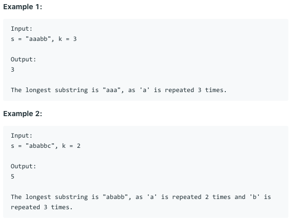

# 问题：395
# Problem: [Longest Substring with At Least K Repeating Characters](https://leetcode.com/problems/longest-substring-with-at-least-k-repeating-characters/)

## 描述 Description
> Find the length of the longest substring T of a given string (consists of lowercase letters only) such that every character in T appears no less than k times.

## 例子 Example

> 


## 分析 Analysis

核心思想：
> 思路1：
>> 时间复杂度：O()
>> 空间复杂度：O()


## 解决方案 Solution
```

```
### 1.

> 时间复杂度：O(nlogn)
> 空间复杂度：O(nlogn)

### Python


```python
class Solution:
    def longestSubstring(self, s: str, k: int) -> int:
        if len(s) < k:
            return 0
        count = collections.Counter(s)
        separators = [c for c in count if count[c] < k]
        if not separators:
            return len(s)
        subs = re.split('|'.join(separators), s)
        return max(self.longestSubstring(sub, k) for sub in subs)
```

### C++

```c++

```


### 2.

> 时间复杂度：O()
> 空间复杂度：O()

### Python


```python

```

### C++

```c++

```


## 总结

### 1.看到这个问题，我最初是怎么思考的？我是怎么做的？遇到了哪些问题？


### 2.别人是怎么思考的？别人是怎么做的？


### 3.与他的做法相比，我有哪些可以提升的地方？


```python

```
