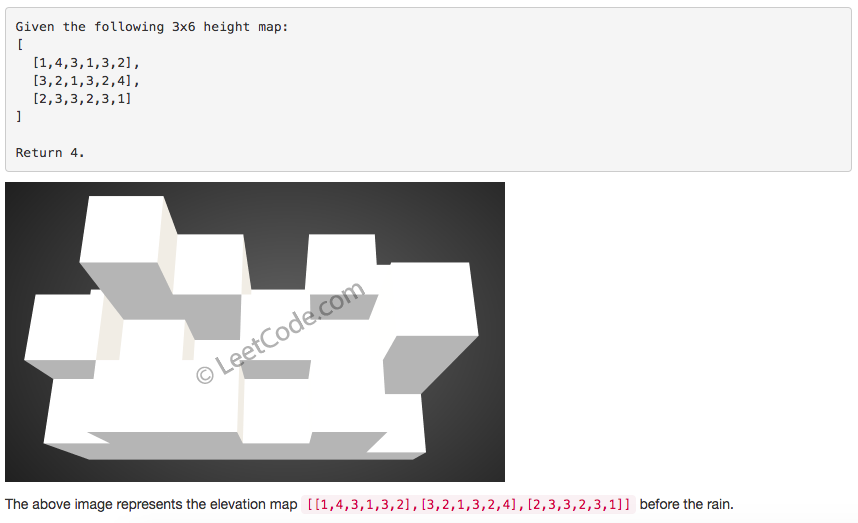
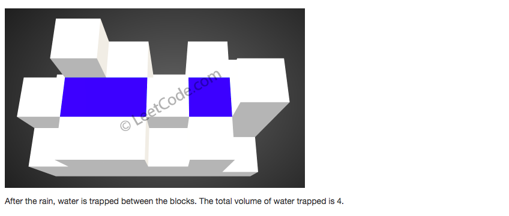

# 问题：407
# Problem: [Trapping Rain Water II](https://leetcode.com/problems/trapping-rain-water-ii/description/)

## 描述 Description
> ### Given an m x n matrix of positive integers representing the height of each unit cell in a 2D elevation map, compute the volume of water it is able to trap after raining.

 

Note:

Both m and n are less than 110. The height of each unit cell is greater than 0 and is less than 20,000.

> ### 

## 例子 Example
### Example 1

> 
> 

## 分析 Analysis

核心思想：
> 思路1：This is a bottom-up BFS problem, use minimum heap to solve it 
>> 时间复杂度：O(mn(m+n)
>> 空间复杂度：O(mn)


## 定义 Definition

### Python


```python
class Solution:
    def trapRainWater(self, heightMap: List[List[int]]) -> int:

```

### C++

```c++

```


## 解决方案 Solution
```

```
### 1.

> 时间复杂度：O(mn(m+n))
> 空间复杂度：O(n)

### Python


```python
class Solution:
    def trapRainWater(self, heightMap: List[List[int]]) -> int:
        # heap
        if len(heightMap) < 1 or len(heightMap[0]) < 1:
            return 0
        import heapq
        m,n = len(heightMap), len(heightMap[0])
        heap = []
        visited = [[False] * n for _ in range(m)]
        for i in range(m):
            for j in range(n):
                if i == 0 or i == m -1 or j == 0 or j == n - 1:
                    heapq.heappush(heap, (heightMap[i][j],i,j))
                    visited[i][j] = True
        res = 0
        while heap:
            cur, r, c = heapq.heappop(heap)
            for i,j in [(r-1,c),(r+1,c),(r,c-1),(r,c+1)]:
                if 0 <= i < m and 0 <= j < n and visited[i][j] == False:
                    res += max(cur - heightMap[i][j],0)
                    visited[i][j] = True
                    heapq.heappush(heap, (max(cur, heightMap[i][j]), i, j))
        return res
                    
        
```

### C++

```c++

```


### 2.

> 时间复杂度：O()
> 空间复杂度：O()

### Python


```python

```

### C++

```c++

```


## 总结

### 1.看到这个问题，我最初是怎么思考的？我是怎么做的？遇到了哪些问题？
想到了木桶原理，从最小的值开始找。没想到用最小堆。

### 2.别人是怎么思考的？别人是怎么做的？


### 3.与他的做法相比，我有哪些可以提升的地方？
1. 最小堆可以用import heapq来调用，实现的复杂度是O（n)，n是heap的长度
2. heap的初始化和更新都要熟练 

	``` 
	heap = []  
	heapq.heappush(heap, 1)
	val = heapq.heappop(heap)
	```


```python

```
