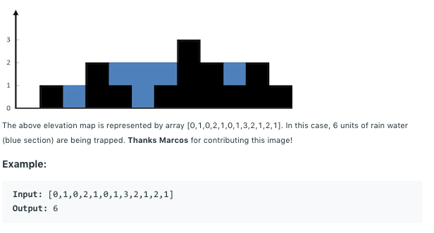

# 问题：42
# Problem: [Trapping Rain Water](https://leetcode.com/problems/trapping-rain-water/)

## 描述 Description
> ### Given n non-negative integers representing an elevation map where the width of each bar is 1, compute how much water it is able to trap after raining.


## 例子 Example
 
> 


## 分析 Analysis

核心思想：巧妙地利用monotone stack
> 思路1：
>> 时间复杂度：O(n)
>> 空间复杂度：O(n)


## 解决方案 Solution
```

```
### 1.

> 时间复杂度：O()
> 空间复杂度：O()

### Python


```python
class Solution:
    def trap(self, height: List[int]) -> int:
        # mono decreasing stack
        # input control
        if not height:
            return 0
        stack = collections.deque([0]) # position and height
        res = 0
        for i in range(1,len(height)):
            while stack and height[i] > height[stack[-1]]:
                sink = stack.pop()
                if stack:
                    res += (i - stack[-1] - 1) * (min(height[i], height[stack[-1]]) - height[sink])
            stack.append(i)
        return res
```

### C++

```c++

```


### 2.

> 时间复杂度：O()
> 空间复杂度：O()

### Python


```python

```

### C++

```c++

```


## 总结

### 1.看到这个问题，我最初是怎么思考的？我是怎么做的？遇到了哪些问题？


### 2.别人是怎么思考的？别人是怎么做的？


### 3.与他的做法相比，我有哪些可以提升的地方？


```python

```
