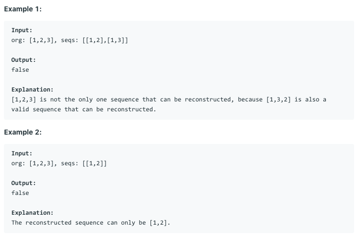
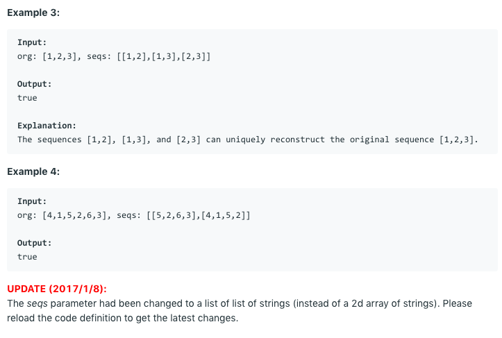

# 问题：444
# Problem: [Sequence Reconstruction](https://leetcode.com/problems/sequence-reconstruction/)

## 描述 Description
> Check whether the original sequence org can be uniquely reconstructed from the sequences in seqs. The org sequence is a permutation of the integers from 1 to n, with 1 ≤ n ≤ 104. Reconstruction means building a shortest common supersequence of the sequences in seqs (i.e., a shortest sequence so that all sequences in seqs are subsequences of it). Determine whether there is only one sequence that can be reconstructed from seqs and it is the org sequence.


## 例子 Example
 
> 
> 

## 分析 Analysis

核心思想：
> 思路1：
>> 时间复杂度：O()
>> 空间复杂度：O()


## 解决方案 Solution
```

```
### 1.

> 时间复杂度：O()
> 空间复杂度：O()

### Python


```python
class Solution:
    def sequenceReconstruction(self, org: List[int], seqs: List[List[int]]) -> bool:
        # input control
        if not org and not seqs:
            return True
        if not org or not seqs:
            return False
        values = {x for seq in seqs for x in seq}
        graph = {x : [] for x in values}
        inDegree = {x : 0 for x in values}
        for seq in seqs:
            for i in range(len(seq) - 1):
                src = seq[i]
                tgt = seq[i+1]
                graph[src].append(tgt)
                inDegree[tgt] += 1
                
        toVisit = collections.deque()
        for node in values:
            if inDegree[node] == 0:
                toVisit.append(node)
        
        visited = []
        while len(toVisit) == 1:
            node = toVisit.popleft()
            visited.append(node)
            for nxt in graph[node]:
                inDegree[nxt] -= 1
                if inDegree[nxt] == 0:
                    toVisit.append(nxt)
        
        return len(values) == len(visited) and visited == org

```

### C++

```c++

```


### 2.

> 时间复杂度：O()
> 空间复杂度：O()

### Python


```python

```

### C++

```c++

```


## 总结

### 1.看到这个问题，我最初是怎么思考的？我是怎么做的？遇到了哪些问题？


### 2.别人是怎么思考的？别人是怎么做的？


### 3.与他的做法相比，我有哪些可以提升的地方？
这道题用dictionary 来存adjacency list和in degree要比用list存方便多了。


```python

```
