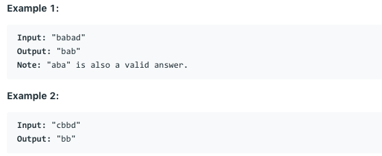

# 问题：5
# Problem: [Longest Palindromic Substring](https://leetcode.com/problems/longest-palindromic-substring/)

## 描述 Description
> Given a string s, find the longest palindromic substring in s. You may assume that the maximum length of s is 1000.


## 例子 Example
 
> 


## 分析 Analysis

核心思想：
> 思路1：
>> 时间复杂度：O()
>> 空间复杂度：O()


## 解决方案 Solution
```
Expand from the center
```
### 1. 

> 时间复杂度：O(N^2)
> 空间复杂度：O(1)

### Python


```python
class Solution:
    def longestPalindrome(self, s: str) -> str:
        # input control
        if not s:
            return s
        center = 0
        res = ""
        while center < len(s):
            left = center - 1
            while center + 1 < len(s) and s[center + 1] == s[center]:
                center += 1
            right = center + 1
            while left >= 0 and right < len(s) and s[left] == s[right]:
                left -= 1
                right += 1
            if len(res) < right - left - 1:
                res = s[left + 1: right]
            center += 1
        return res
    # Time complexity: O(N^2)
    # Space complexity: O(1)
```

### C++

```c++

```


### 2. Manacher's algorithm

> 时间复杂度：O(N)
> 空间复杂度：O(1)

### Python


```python

```

### C++

```c++

```


## 总结

### 1.看到这个问题，我最初是怎么思考的？我是怎么做的？遇到了哪些问题？


### 2.别人是怎么思考的？别人是怎么做的？


### 3.与他的做法相比，我有哪些可以提升的地方？


```python

```
