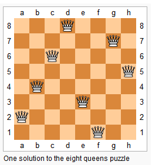
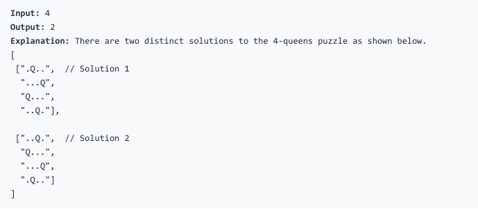

# 问题：52
# Problem: [N-Queens II](https://leetcode.com/problems/n-queens-ii/)

## 描述 Description
> The n-queens puzzle is the problem of placing n queens on an n×n chessboard such that no two queens attack each other.
> 

> Given an integer n, return the number of distinct solutions to the n-queens puzzle.

## 例子 Example

> 


## 分析 Analysis

核心思想：
> 思路1：This is a backtracking problem
>> 时间复杂度：O(n!)
>> 空间复杂度：O(n)


## 定义 Definition

### Python


```python


```

### C++

```c++

```


## 解决方案 Solution
```

```
### 1.

> 时间复杂度：O(n!)
> 空间复杂度：O(n)

### Python


```python
class Solution:
    def totalNQueens(self, n):
        """
        :type n: int
        :rtype: int
        """
        def is_valid(row, col):
            return not (rows[col] or hills[row-col] or dales[row+col])
        
        def place_queen(row, col):
            rows[col] = 1
            hills[row-col] = 1
            dales[row+col] = 1
        
        def remove_queen(row, col):
            rows[col] = 0
            hills[row-col] = 0
            dales[row+col] = 0
        
        def backtrack(row = 0, count = 0):
            if row == n:
                return count + 1
            for col in range(n):
                if is_valid(row, col):
                    place_queen(row, col)
                    count = backtrack(row+1, count)
                    remove_queen(row, col)
            return count
        
        rows = [0] * n
        hills = [0] * (2*n - 1)
        dales = [0] * (2*n - 1)
        return backtrack()
        
```

### C++

```c++

```


### 2.

> 时间复杂度：O()
> 空间复杂度：O()

### Python


```python

```

### C++

```c++

```


## 总结

### 1.看到这个问题，我最初是怎么思考的？我是怎么做的？遇到了哪些问题？
一开始就是用标准的 backtracking 方法解，可以提交，就是速度比较慢。

### 2.别人是怎么思考的？别人是怎么做的？

利用几个state variables (rows, hills, dales)，节省了大量时间和空间。

### 3.与他的做法相比，我有哪些可以提升的地方？

做完一个算法后，还可以想想哪里还有提升的空间，还能怎么提高。大多数算法都是不断改进出来的。先想一个最简单的最直观的算法，然后思考哪一步比较耗时间，然后如何改进。这个思索过程才是最重要的。

```python

```
