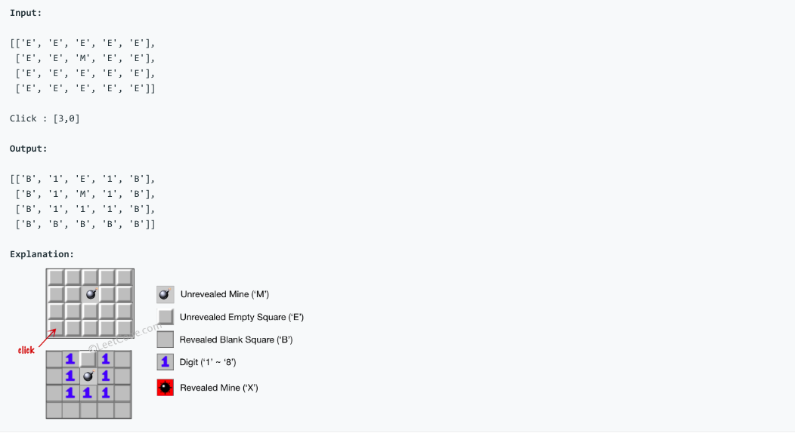
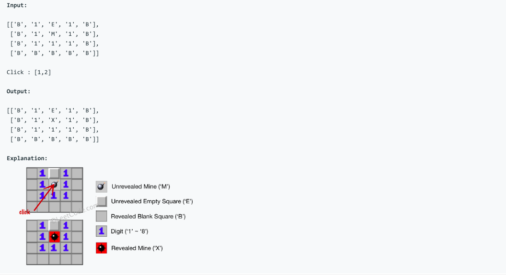

# 问题：529
# Problem: [Minesweeper](https://leetcode.com/problems/minesweeper/)

## 描述 Description
> ### Let's play the minesweeper game (Wikipedia, online game)!

You are given a 2D char matrix representing the game board. 'M' represents an unrevealed mine, 'E' represents an unrevealed empty square, 'B' represents a revealed blank square that has no adjacent (above, below, left, right, and all 4 diagonals) mines, digit ('1' to '8') represents how many mines are adjacent to this revealed square, and finally 'X' represents a revealed mine.

Now given the next click position (row and column indices) among all the unrevealed squares ('M' or 'E'), return the board after revealing this position according to the following rules:

If a mine ('M') is revealed, then the game is over - change it to 'X'.
If an empty square ('E') with no adjacent mines is revealed, then change it to revealed blank ('B') and all of its adjacent unrevealed squares should be revealed recursively.
If an empty square ('E') with at least one adjacent mine is revealed, then change it to a digit ('1' to '8') representing the number of adjacent mines.
Return the board when no more squares will be revealed.

> ### 

## 例子 Example
### Example 1


### Example 2


## 分析 Analysis

核心思想：
> 思路1：This is a DFS problem, use recursive approach
>> 时间复杂度：O(nlogn)
>> 空间复杂度：O(n)


## 定义 Definition

### Python


```python
class Solution:
    def updateBoard(self, board: List[List[str]], click: List[int]) -> List[List[str]]:

```

### C++

```c++

```


## 解决方案 Solution
```
test(board,click):
	s = Solutions()
	print(board)
	board = s.updateBoard(board,click)
	print(click)
	print(board)
```
### 1.

> 时间复杂度：O(nlogn)
> 空间复杂度：O(n)

### Python


```python
class Solution:
    def updateBoard(self, board: List[List[str]], click: List[int]) -> List[List[str]]:
        # this is a DFS problem, use recursive algorithm 
        # Time Complexity O(NlogN)
        # Space complexity O(N)
        r,c = click
        bx,by = len(board),len(board[0])
        if 0 <= r < bx and 0 <= c < by:
            # none empty
            if board[r][c] == 'M':
                board[r][c] = 'X'
            elif board[r][c] == 'E':
                dirs = [(-1,-1),(-1,0),(-1,1),(0,-1),(0,1),(1,-1),(1,0),(1,1)]
                nbs = [(r+d[0],c+d[1]) for d in dirs]
                #print(nbs)
                nbs = [nb for nb in nbs if 0 <= nb[0] < bx and 0 <= nb[1] < by]
                mine_n = sum([board[v][h]=='M' for v,h in nbs])
                if mine_n:
                    board[r][c]=str(mine_n)
                else:
                    board[r][c] = 'B'
                    for nb in nbs:
                        board = self.updateBoard(board, nb)
        return board
```

### C++

```c++

```

### Java

```java

```

### 2.

> 时间复杂度：O()
> 空间复杂度：O()

### Python


```python

```

### C++

```c++

```


## 总结

### 1.看到这个问题，我最初是怎么思考的？我是怎么做的？遇到了哪些问题？
> 刚看到这个问题时，想到的是套用DFS模板，建立一个helper function，进行迭代，把程序写得很长。1X1 的情况没考虑到，导致运行一直出错，还有一个 list.remove()使用错误，调了很久才发现，这是一个inplace function，返回的是none，我把返回值又赋予了list本身，导致了问题。

### 2.别人是怎么思考的？别人是怎么做的？
> 别人的代码直接用updateBoard function当做helper function进行recursive，代码简洁了很多。

### 3.与他的做法相比，我有哪些可以提升的地方？
> 1. Python中不等式可以连续用的 1 < x < 2这个是成立的，我还傻傻的用1 < x and x < 2。 
> 2. 变量名比较长的时候，可以用简单的替代 （r,c) = click。 
> 3. 还有一个就是找neighbours 时直接复制 8个方向，比我原来的方法要快。


```python

```
