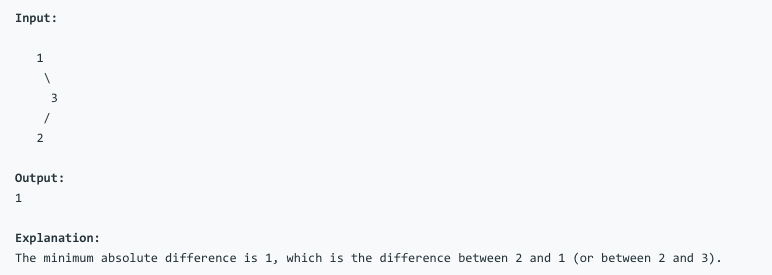

# 问题：530
# Problem: [Minimum Absolute Difference in BST](https://leetcode.com/problems/minimum-absolute-difference-in-bst/)

## 描述 Description
> ### Given a binary search tree with non-negative values, find the minimum absolute difference between values of any two nodes.

> ### 

## 例子 Example
### Example 1

> 

## 分析 Analysis

核心思想：
> 思路1：This is a DFS problem, use recursive approach, use the property of BST: in-order traversal result in a ordered sequence
>> 时间复杂度：O(n)
>> 空间复杂度：O(n)


## 定义 Definition

### Python


```python
# Definition for a binary tree node.
# class TreeNode:
#     def __init__(self, x):
#         self.val = x
#         self.left = None
#         self.right = None

class Solution:
    def getMinimumDifference(self, root: TreeNode) -> int:

```

### C++

```c++

```


## 解决方案 Solution
```
class TreeNode:
	def __init__(self, x):
		self.val = x
		self.left = None
		self.right = None
		
def test(seqs):
	def seq2tree(seqs):
		# seq: a list 
		root = TreeNode(seqs[0])
		q = [root]
		i = 1
		while i < len(seqs):
			cur = q.pop(0)
			if seqs[i] != None:
				cur.left = TreeNode(seqs[i])
				q.append(cur.left)
			if i+1 < len(seqs) and seqs[i+1] != None:
				cur.right = TreeNode(seqs[i+1])
				q.append(cur.right)
			i += 2
		return root
	
	root = seq2tree(seqs)
	s = Solution()
	print(s.getMinimumDifference(root)）
	
		
	
```
### 1.
in-order traversal
> 时间复杂度：O(n)
> 空间复杂度：O(n)

### Python


```python
class Solution:
    def getMinimumDifference(self, root: TreeNode) -> int:
        # DFS problem
        # use recursive
        # Time complexity 
         
        # solution 1, In order traversal
        self.min = 2**31
        self.cur = -2**31
        self._helper(root)
        return self.min
    
    def _helper(self,root):
        if not root:
            return
        self._helper(root.left)
        if root.val - self.cur < self.min:
                self.min = root.val - self.cur
        self.cur = root.val
        self._helper(root.right)
```

### C++

非递归中序遍历模板

```c++
//中序遍历
void InOrderWithoutRecursion2(BTNode* root)
{
	//空树
	if (root == NULL)
		return;
	//树非空
	BTNode* p = root;
	stack<BTNode*> s;
	while (!s.empty() || p)
	{
		if (p)
		{
			s.push(p);
			p = p->lchild;
		}
		else
		{
			p = s.top();
			s.pop();
			cout << setw(4) << p->data;
			p = p->rchild;
		}
	}
```


### 2.
Pre order traversal
> 时间复杂度：O(n)
> 空间复杂度：O(n)

### Python


```python
class Solution:
    def getMinimumDifference(self, root: TreeNode) -> int:
        self.min = 2**31
        self._helper(root, -2**31, 2**31)
        return self.min
    
    def _helper(self, root,low, high):
        if not root:
            return
        self.min = min([self.min, root.val-low, high-root.val])
        self._helper(root.left, low, root.val)
        self._helper(root.right, root.val, high)
```

### C++

```c++

```

### 3.
Inorder-traversal without recursive
### Python

```python
class Solution:
    def getMinimumDifference(self, root: TreeNode) -> int:
        if not root:
            return None
        s = []
        mini = 2**31
        pre = -2**31
        p = root
        while len(s) > 0 or p:
            if p:
                s.append(p)
                p = p.left
            else:
                p = s.pop(-1)
                mini = min(mini, p.val - pre)
                pre = p.val
                p = p.right
                
        return mini
```


## 总结

### 1.看到这个问题，我最初是怎么思考的？我是怎么做的？遇到了哪些问题？
一看到这个问题，我就想到用DFS来做，建了一个helper function，想用左子树的最大值和根节点比较，用右子树的最小值和根节点比较，发现这个逻辑很难实现递归，一直报错。原因在于左子树的右子树，对左子树根节点，我们需要最小值，但对上一级的根节点，我们需要的是最大值。这是一个post-order的想法。

### 2.别人是怎么思考的？别人是怎么做的？
别人利用BST的特性，中序遍历的结果是排好序的，直接比较相邻的两个值就行


### 3.与他的做法相比，我有哪些可以提升的地方？
对BST的特性还不熟，遍历迭代算法写的不是很好。还有python中没有int的最大值、最小值，极端值可以用2**31来设置。python 中Queue可以用list替代，pop(0),append.
对于非迭代算法很不熟练。


```python

```
