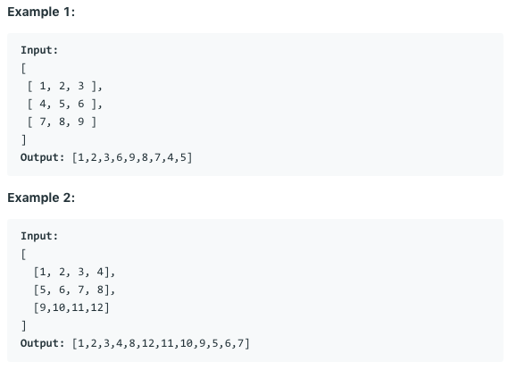

# 问题：54
# Problem: [Spiral Matrix](https://leetcode.com/problems/spiral-matrix/)

## 描述 Description
> Given a matrix of m x n elements (m rows, n columns), return all elements of the matrix in spiral order.


## 例子 Example

> 

## 分析 Analysis

核心思想：
> 思路1：
>> 时间复杂度：O()
>> 空间复杂度：O()


## 解决方案 Solution
```

```
### 1.

> 时间复杂度：O(n)
> 空间复杂度：O(1)

### Python


```python
class Solution:
    def spiralOrder(self, matrix: List[List[int]]) -> List[int]:
        if not matrix or not matrix[0]:
            return []
        top, bottom, left, right = 0, len(matrix)-1, 0, len(matrix[0])-1
        res = []
        while top <= bottom and left <= right:
            # top boundary
            for i in range(left, right+1):
                res.append(matrix[top][i])
            top += 1
            if top > bottom:
                break
            # right boundary
            for i in range(top, bottom+1):
                res.append(matrix[i][right])
            right -= 1
            if left > right:
                break
            # bottom boundary
            for i in range(right, left-1, -1):
                res.append(matrix[bottom][i])
            bottom -= 1
            if top > bottom:
                break
            # left boundary
            for i in range(bottom, top-1, -1):
                res.append(matrix[i][left])
            left += 1
            
        return res

            
```

### C++

```c++

```


### 2.

> 时间复杂度：O()
> 空间复杂度：O()

### Python


```python

```

### C++

```c++

```


## 总结

### 1.看到这个问题，我最初是怎么思考的？我是怎么做的？遇到了哪些问题？


### 2.别人是怎么思考的？别人是怎么做的？


### 3.与他的做法相比，我有哪些可以提升的地方？


```python

```
