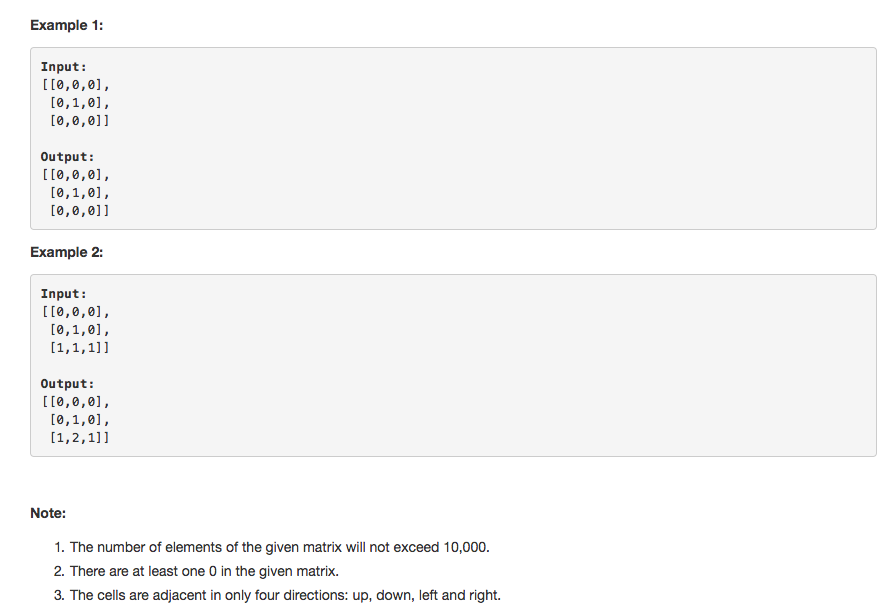

# 问题：542
# Problem: [01 Matrix](https://leetcode.com/problems/01-matrix/description/)

## 描述 Description
> ### Given a matrix consists of 0 and 1, find the distance of the nearest 0 for each cell.

The distance between two adjacent cells is 1.

> ### 

## 例子 Example
### Example 1

> 


## 分析 Analysis

核心思想：
> 思路1：这题可以用DP解，也可以用BFS解。
>> 时间复杂度：O(mn)
>> 空间复杂度：O(1)


## 定义 Definition

### Python


```python
class Solution:
    def updateMatrix(self, matrix: List[List[int]]) -> List[List[int]]:

```

### C++

```c++

```


## 解决方案 Solution
```

```
### 1. BFS

> 时间复杂度：O(mn)
> 空间复杂度：O(1)

### Python


```python

class Solution:
    def updateMatrix(self, matrix: List[List[int]]) -> List[List[int]]:
        if len(matrix) < 1 or len(matrix[0]) < 1: 
            return matrix

        m,n = len(matrix), len(matrix[0])
        queue = collections.deque()
        for i in range(m):
            for j in range(n):
                if matrix[i][j] == 1:
                    matrix[i][j] = float('Inf')
                else:
                    queue.append((i,j))
        # BFS
        while queue:
            (row,col) = queue.popleft()
            for i,j in [(row-1, col), (row+1, col), (row, col-1), (row, col+1)]:
                if 0 <= i < len(matrix) and 0 <= j < len(matrix[0]) and matrix[i][j] == float('Inf'):
                    matrix[i][j] = matrix[row][col] + 1
                    queue.append((i,j))
        return matrix
        
        
        
```

### C++

```c++

```


### 2. DP

> 时间复杂度：O(mn)
> 空间复杂度：O()

### Python


```python
class Solution:
    def updateMatrix(self, matrix: List[List[int]]) -> List[List[int]]:
        # solution 2, DP
        if len(matrix) < 1 or len(matrix[0]) < 1:
            return matrix
        m,n = len(matrix), len(matrix[0])
        # initialization
        for i in range(m):
            for j in range(n):
                matrix[i][j] = float('Inf') if matrix[i][j] == 1 else 0
        # update, from top-left to bottom-right
        for r in range(m):
            for c in range(n):
                for i,j in [(r+1,c),(r,c+1)]:
                    if i < m and j < n:
                        matrix[i][j] = min(matrix[r][c]+1, matrix[i][j])
        # update from the bottom-right to top-left
        for r in range(m-1,-1,-1):
            for c in range(n-1,-1,-1):
                for i,j in [(r-1,c), (r,c-1)]:
                    if i >= 0 and j >=0:
                        matrix[i][j] = min(matrix[r][c]+1, matrix[i][j])
        
        return matrix
```

### C++

```c++

```


## 总结

### 1.看到这个问题，我最初是怎么思考的？我是怎么做的？遇到了哪些问题？


### 2.别人是怎么思考的？别人是怎么做的？


### 3.与他的做法相比，我有哪些可以提升的地方？

这题可以用DP，也可以用BFS。 BFS的思想还是bottom-up。从叶节点开始prune。把值为0的点当做叶节点。

```python

```
