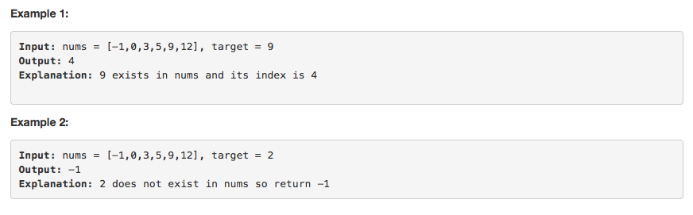

# 问题：704
# Problem: [Binary Search](https://leetcode.com/problems/binary-search/description/)

## 描述 Description
> ### Given a sorted (in ascending order) integer array nums of n elements and a target value, write a function to search target in nums. If target exists, then return its index, otherwise return -1.

> ### 

## 例子 Example
### Example 1

> 


## 分析 Analysis

核心思想：
> 思路1：This is a binary search problem. For binary search, even though both recursion and while loop are applicable, we should use while loop as first choice. The reason is that recursion will occupy the function calling stack, which may be stack over flow. There are many trivals in this simple problem should be taken care. Always use the template to solve binary search problem
>> 时间复杂度：O(logn)
>> 空间复杂度：O(1)


## 定义 Definition

### Python


```python
class Solution:
    def search(self, nums: List[int], target: int) -> int:

```

### C++

```c++

```


## 解决方案 Solution
```
def test(nums, target):
	s = Solution()
	print(s.search(nums, target))

```
### 1.

> 时间复杂度：O(logn)
> 空间复杂度：O(n)

### Python


```python
class Solution:
    def search(self, nums: List[int], target: int) -> int:
        # use binary search
        # two pointers
        # Time complexity O(logn)
        # Space complexity O(1)
        
        # input control
        if len(nums) == 0:
            return -1
        
        # two pointers
        # always use start,end, and mid
        start,end = 0,len(nums)-1
        while start + 1 < end: # use this condition for while loop
        	  # use start + (end - start) // 2 instead of 
        	  # (start + end ) // 2 just to avoid overfloat in C/Java
            mid = start + (end - start) // 2 
            if nums[mid] == target:
                return mid
            elif nums[mid] < target:
                start = mid
            else:
                end = mid
        # Don't forget to compare the start/end position in the end
        if nums[start] == target:
            return start
        if nums[end] == target:
            return end
        
        return -1
```

### C++

```c++

```


### 2.

> 时间复杂度：O()
> 空间复杂度：O()

### Python


```python

```

### C++

```c++

```


## 总结

### 1.看到这个问题，我最初是怎么思考的？我是怎么做的？遇到了哪些问题？
这题很简单，但很重要。指针移动的边界条件很容易做错


### 2.别人是怎么思考的？别人是怎么做的？
用模板做，可以避免每道题都要考虑不同的边界和移动规则

### 3.与他的做法相比，我有哪些可以提升的地方？
1. while condition start + 1 < end
2. mid = start + (end - start) // 2
3. if nums[start] == start / nums[end] == start in the end


```python

```
