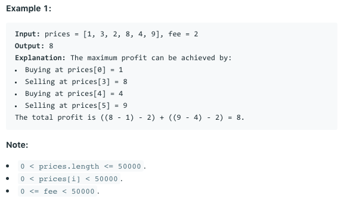

# 问题：714
# Problem: [Best Time to Buy and Sell Stock with Transaction Fee](https://leetcode.com/problems/best-time-to-buy-and-sell-stock-with-transaction-fee/)

## 描述 Description
> Your are given an array of integers prices, for which the i-th element is the price of a given stock on day i; and a non-negative integer fee representing a transaction fee.

> You may complete as many transactions as you like, but you need to pay the transaction fee for each transaction. You may not buy more than 1 share of a stock at a time (ie. you must sell the stock share before you buy again.)

> Return the maximum profit you can make.


## 例子 Example

> 

## 分析 Analysis

核心思想：
DP, use 121 template
> 思路1：
>> 时间复杂度：O()
>> 空间复杂度：O()


## 解决方案 Solution
```

```
### 1.

> 时间复杂度：O()
> 空间复杂度：O()

### Python


```python
class Solution:
    def maxProfit(self, prices: List[int], fee: int) -> int:
        # input control
        if not prices:
            return 0
        buy = float('-Inf')
        sell = 0
        for price in prices:
            buy,sell = max(buy,sell-price), max(sell, price + buy - fee)
        return sell
```

### C++

```c++

```


### 2.

> 时间复杂度：O()
> 空间复杂度：O()

### Python


```python

```

### C++

```c++

```


## 总结

### 1.看到这个问题，我最初是怎么思考的？我是怎么做的？遇到了哪些问题？


### 2.别人是怎么思考的？别人是怎么做的？


### 3.与他的做法相比，我有哪些可以提升的地方？


```python

```
