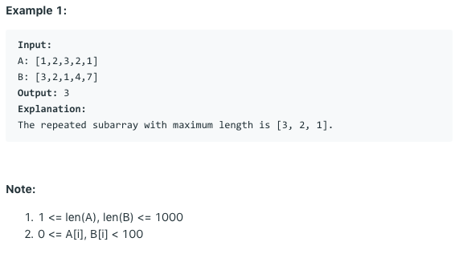

# 问题：718
# Problem: [Maximum Length of Repeated Subarray](https://leetcode.com/problems/maximum-length-of-repeated-subarray/)

## 描述 Description
> Given two integer arrays A and B, return the maximum length of an subarray that appears in both arrays.


## 例子 Example

> 


## 分析 Analysis

核心思想：
> 思路1：
>> 时间复杂度：O()
>> 空间复杂度：O()


## 解决方案 Solution
```

```
### 1.

> 时间复杂度：O(nm)
> 空间复杂度：O(nm)

### Python


```python
class Solution:
    def findLength(self, A: List[int], B: List[int]) -> int:
        # input control
        if not A or not B:
            return 0
        s = [[0] * (len(B)+1) for _ in range(len(A)+1)]
        res = 0
        for i in range(len(A)):
            for j in range(len(B)):
                if A[i] == B[j]:
                    s[i+1][j+1] = s[i][j] + 1
                    res = max(res, s[i+1][j+1])
        return res
```

### C++

```c++

```


### 2.

> 时间复杂度：O()
> 空间复杂度：O()

### Python


```python

```

### C++

```c++

```


## 总结

### 1.看到这个问题，我最初是怎么思考的？我是怎么做的？遇到了哪些问题？


### 2.别人是怎么思考的？别人是怎么做的？


### 3.与他的做法相比，我有哪些可以提升的地方？


```python

```
