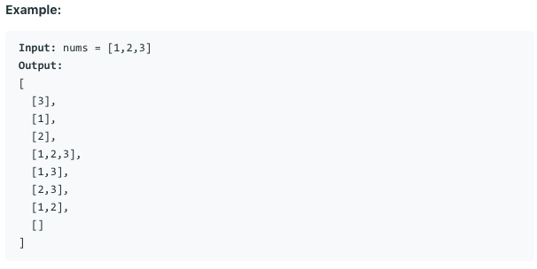

# 问题：78
# Problem: [Subsets](https://leetcode.com/problems/subsets/)

## 描述 Description
> Given a set of distinct integers, nums, return all possible subsets (the power set).

> Note: The solution set must not contain duplicate subsets.


## 例子 Example
 
> 


## 分析 Analysis

核心思想：
> 思路1：
>> 时间复杂度：O()
>> 空间复杂度：O()


## 解决方案 Solution
```

```
### 1. bit manipulation

> 时间复杂度：O(n)
> 空间复杂度：O(1)

### Python


```python
class Solution:
    def subsets(self, nums: List[int]) -> List[List[int]]:
        # input control
        if len(nums) < 1:
            return [nums]
        res = []
        for i in range(2 ** len(nums)):
            tmp = []
            j = 0
            while i > 0:
                if i & 1 > 0:
                    tmp.append(nums[j])
                i = i >> 1
                j += 1
            res.append(tmp)
        return res
```

### C++

```c++

```


### 2. backtracking

> 时间复杂度：O(n)
> 空间复杂度：O(n)

### Python


```python
class Solution:
    def subsets(self, nums: List[int]) -> List[List[int]]:
        # input control
        if len(nums) < 1:
            return [nums]
        res = []
        self.helper(res, nums, 0, [])
        return res
    
    def helper(self, res, nums, idx, tmp):
        if idx > len(nums):
            return 
        res.append(tmp)
        for i in range(idx, len(nums)):
            self.helper(res, nums, i+1, tmp + [nums[i]])

```

### C++

```c++

```


## 总结

### 1.看到这个问题，我最初是怎么思考的？我是怎么做的？遇到了哪些问题？


### 2.别人是怎么思考的？别人是怎么做的？


### 3.与他的做法相比，我有哪些可以提升的地方？


```python

```
