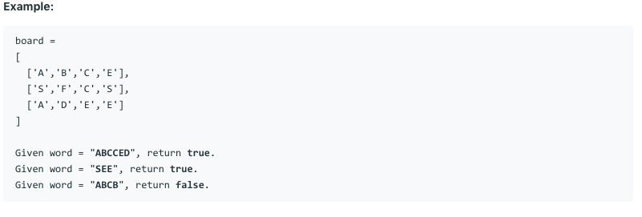

# 问题：79
# Problem: [Word Search](https://leetcode.com/problems/word-search/)

## 描述 Description
>Given a 2D board and a word, find if the word exists in the grid.

>The word can be constructed from letters of sequentially adjacent cell, where "adjacent" cells are those horizontally or vertically neighboring. The same letter cell may not be used more than once.

## 例子 Example
### Example 1

> 

## 分析 Analysis

核心思想：
> 思路1：This is a DFS problem, use recursive approach
>> 时间复杂度：O(n)
>> 空间复杂度：O(n)


## 定义 Definition

### Python


```python


```

### C++

```c++

```


## 解决方案 Solution
```

```
### 1.

> 时间复杂度：O(n)
> 空间复杂度：O(n)

### Python


```python
class Solution:
    def exist(self, board, word) :
        if len(board) < 1 or len(board[0]) < 1 or len(word) < 1:
            return False
        for i in range(len(board)):
            for j in range(len(board[0])):
                if board[i][j] == word[0] and self.dfs(board, i,j, word, 0):
                    return True
        return False
    @staticmethod
    def dfs(board, r,c, word, word_index):
        if len(word) - 1 == word_index:
            return True
        board[r][c] = ''
        for i,j in [(r,c+1),(r,c-1),(r+1,c),(r-1,c)]:
            if 0 <= i < len(board) and 0 <= j < len(board[0]) and board[i][j] == word[word_index+1] and self.dfs(board, i, j, word, word_index+1):
                return True
        board[r][c] = word[word_index]
        return False


```

### C++

```c++

```


### 2.

> 时间复杂度：O()
> 空间复杂度：O()

### Python


```python

```

### C++

```c++

```


## 总结

### 1.看到这个问题，我最初是怎么思考的？我是怎么做的？遇到了哪些问题？


### 2.别人是怎么思考的？别人是怎么做的？


### 3.与他的做法相比，我有哪些可以提升的地方？
DFS + backtracking


```python

```
