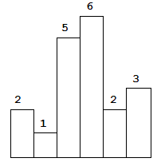
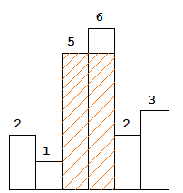

# 问题：85
# Problem: [Largest Rectangle in Histogram](https://leetcode.com/problems/largest-rectangle-in-histogram/description/)

## 描述 Description
> ### Given n non-negative integers representing the histogram's bar height where the width of each bar is 1, find the area of largest rectangle in the histogram.

 


Above is a histogram where width of each bar is 1, given height = [2,1,5,6,2,3].

 


The largest rectangle is shown in the shaded area, which has area = 10 unit.

> ### 

## 例子 Example
### Example 1

> Input: [2,1,5,6,2,3]  
>  Output: 10


## 分析 Analysis

核心思想：
> 思路1：这题有很多种不同的解法，可以双指针 O(n^2)，可以divide and conquer O(nlogn),最巧妙的是利用栈结构来解 O(n)
>> 时间复杂度：O(n)
>> 空间复杂度：O(n)


## 定义 Definition

### Python


```python
class Solution:
    def largestRectangleArea(self, heights: List[int]) -> int:

```

### C++

```c++

```


## 解决方案 Solution
```

```
### 1.
利用栈来解
> 时间复杂度：O(n)
> 空间复杂度：O(n)

### Python


```python
class Solution:
    def largestRectangleArea(self, heights: List[int]) -> int:
        # use stack
        if len(heights) == 0:
            return 0
        heights.append(0) # right ending
        stack = collections.deque()
        stack.append(-1)
        ans = 0
        for i in range(len(heights)):
            while heights[i] < heights[stack[-1]]:
                h = heights[stack.pop()]
                ans = max(ans, h * (i - stack[-1] - 1))
            stack.append(i)
        return ans
```

### C++

```c++

```


### 2.

> 时间复杂度：O()
> 空间复杂度：O()

### Python


```python

```

### C++

```c++

```


## 总结

### 1.看到这个问题，我最初是怎么思考的？我是怎么做的？遇到了哪些问题？

一开始想到类似双指针，循环两遍的算法，提交是时间溢出。知道提示是使用栈，想了半天就算使用栈还是O(n^2）。没想到可以这么解。
写程序中bug还是太多，争取一次 bug free
### 2.别人是怎么思考的？别人是怎么做的？
这题的思考方式很巧妙，利用栈来存左边界，通过pop操作来算面积。

### 3.与他的做法相比，我有哪些可以提升的地方？
边界条件设置很巧妙，通过在heights末尾加一个0，在stack开头加一个-1,让程序大大简化。

这种方法适用了找左边或右边比当前值大/小的值

```python

```
