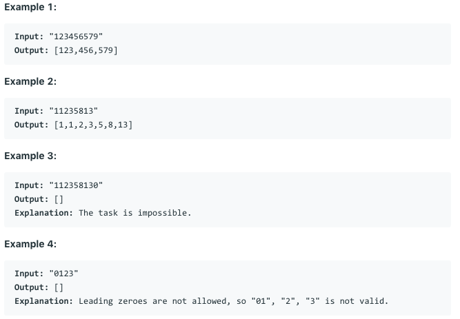
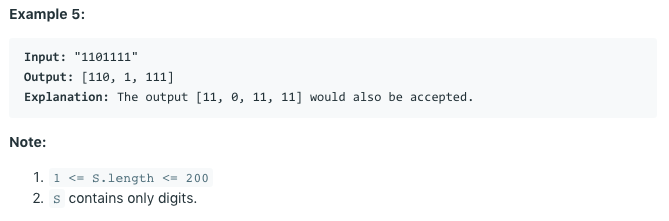

# 问题：842
# Problem: [Split Array into Fibonacci Sequence](https://leetcode.com/problems/split-array-into-fibonacci-sequence/)

## 描述 Description
> Given a string S of digits, such as S = "123456579", we can split it into a Fibonacci-like sequence [123, 456, 579].

Formally, a Fibonacci-like sequence is a list F of non-negative integers such that:

0 <= F[i] <= 2^31 - 1, (that is, each integer fits a 32-bit signed integer type);
F.length >= 3;
and F[i] + F[i+1] = F[i+2] for all 0 <= i < F.length - 2.
Also, note that when splitting the string into pieces, each piece must not have extra leading zeroes, except if the piece is the number 0 itself.

Return any Fibonacci-like sequence split from S, or return [] if it cannot be done.

> ### 

## 例子 Example

> 

> 

## 分析 Analysis

核心思想：
> 思路1：This is searching problem
>> 时间复杂度：O(nlogn)
>> 空间复杂度：O(n)


## 定义 Definition

### Python


```python


```

### C++

```c++

```


## 解决方案 Solution
```

```
### 1.

> 时间复杂度：O(n^2)
> 空间复杂度：O(n)

### Python


```python
class Solution:
    def splitIntoFibonacci(self, S: str) -> List[int]:
        # only need to select the first two integers
        if not S:
            return []
        
        def is_valid(i,j, S):
            res = []
            res.append(int(S[:i+1]))
            res.append(int(S[i+1:j+1]))
            k = j + 1
            while k < len(S):
                nex = res[-2] + res[-1]
                tmp = str(nex)
                if nex > 2**31 - 1 or not S[k:].startswith(tmp):
                    return None
                else:
                    res.append(nex)
                    k += len(tmp)
            return res
        
        for i in range(min(10,len(S))):
            for j in range(i + 1, min(10,len(S)-i-1)):
                    res = is_valid(i,j,S)
                    if res:
                        return res
        return []
```

### C++

```c++

```


### 2.

> 时间复杂度：O()
> 空间复杂度：O()

### Python


```python

```

### C++

```c++

```


## 总结

### 1.看到这个问题，我最初是怎么思考的？我是怎么做的？遇到了哪些问题？


### 2.别人是怎么思考的？别人是怎么做的？


### 3.与他的做法相比，我有哪些可以提升的地方？


```python

```
