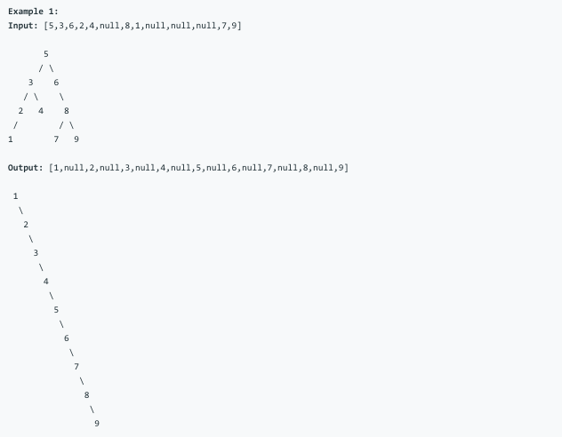

# 问题：897
# Problem: [Increasing Order Search Tree](https://leetcode.com/problems/increasing-order-search-tree/)

## 描述 Description
> ### Given a tree, rearrange the tree in in-order so that the leftmost node in the tree is now the root of the tree, and every node has no left child and only 1 right child.


> ### 

## 例子 Example
### Example 1

> 


## 分析 Analysis

核心思想：
> 思路1：这是一题很简单的DFS问题，用in-order traversal就可以解决，关键是generator思想。
>> 时间复杂度：O(nlogn)
>> 空间复杂度：O(n)


## 定义 Definition

### Python


```python
class TreeNode:
	def __init__(self,x):
		self.val = x
		self.left = None
		self.right = None

class Solution:
	def increasingBST(self, root: TreeNode) -> TreeNode:
		

```

### C++

```c++

```


## 解决方案 Solution
```

```
### 1.

> 时间复杂度：O(n)
> 空间复杂度：O(n)

### Python


```python
class Solution:
	def increasingBST(self, root: TreeNode) -> TreeNode:
		def inorder(root):
			if root:
				yield inorder(root.left)
				yield root.val
				yield inorder(root.right)
		anchor = cur = TreeNode(None)
		for v in inorder(root):
			cur.right = TreeNode(v)
			cur = cur.right
		return anchor.right

```

### C++

```c++

```


### 2.
利用原来的node，重连，速度更快，省空间
> 时间复杂度：O()
> 空间复杂度：O()

### Python


```python
class Solution:
    def increasingBST(self, root: TreeNode) -> TreeNode:
        # recursive solution 1
        
        def inorder(node):
            if node:
                inorder(node.left)
                node.left = None
                self.cur.right = node
                self.cur = node
                inorder(node.right)
                
        ans = self.cur = TreeNode(None)
        inorder(root)
        return ans.right
```

### C++

```c++

```


## 总结

### 1.看到这个问题，我最初是怎么思考的？我是怎么做的？遇到了哪些问题？
这题很简单，一开始我就想到用递归解决。遇到的问题就是引用变量在Python中要用self.variable来表示。参数传递的方式会产生错误。

### 2.别人是怎么思考的？别人是怎么做的？
用generator的方法能更省空间，是更优的做法

### 3.与他的做法相比，我有哪些可以提升的地方？


```python

```
