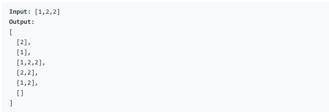

# 问题：90
# Problem: [Subsets II](https://leetcode.com/problems/subsets-ii/)

## 描述 Description
> Given a collection of integers that might contain duplicates, nums, return all possible subsets (the power set).

Note: The solution set must not contain duplicate subsets.


## 例子 Example

> 


## 分析 Analysis

核心思想：
> 思路1：This is a backtracking
>> 时间复杂度：O(nlogn)
>> 空间复杂度：O(n)


## 定义 Definition

### Python


```python


```

### C++

```c++

```


## 解决方案 Solution
```

```
### 1.

> 时间复杂度：O(2^n)
> 空间复杂度：O(n)

### Python


```python
class Solution:
    def subsetsWithDup(self, nums: List[int]) -> List[List[int]]:
        # backtracking problem
        if not nums:
            return [[]]
        self.nums = sorted(nums)
        self.res = [] # final result
        self.backtrack([], 0) # pass the current state to the function
        return self.res
    
    def backtrack(self, subset, cur):
        self.res.append(subset)
        if cur == len(self.nums):
            return
        i = cur
        while i < len(self.nums):
            # pick current value
            self.backtrack(subset + [self.nums[i]], i + 1)
            # skip current value
            while i+1 < len(self.nums) and self.nums[i+1] == self.nums[i]:
                i += 1
            i += 1
        return
            
            
        
            
        
```

### C++

```c++

```


### 2.

> 时间复杂度：O()
> 空间复杂度：O()

### Python


```python

```

### C++

```c++

```


## 总结

### 1.看到这个问题，我最初是怎么思考的？我是怎么做的？遇到了哪些问题？

标准的backtrack problem

### 2.别人是怎么思考的？别人是怎么做的？


### 3.与他的做法相比，我有哪些可以提升的地方？


```python

```
