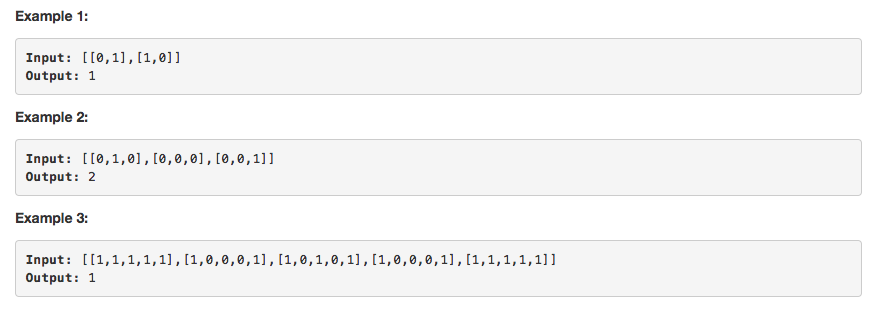

# 问题：934
# Problem: [Shortest Bridge](https://leetcode.com/problems/shortest-bridge/description/)

## 描述 Description
> ### In a given 2D binary array A, there are two islands.  (An island is a 4-directionally connected group of 1s not connected to any other 1s.)

Now, we may change 0s to 1s so as to connect the two islands together to form 1 island.

Return the smallest number of 0s that must be flipped.  (It is guaranteed that the answer is at least 1.)

> ### 

## 例子 Example
### Example 1

> 


## 分析 Analysis

核心思想：
> 思路1：This is a BFS problem
>> 时间复杂度：O(n)
>> 空间复杂度：O(n)


## 定义 Definition

### Python


```python
class Solution:
    def shortestBridge(self, A: List[List[int]]) -> int:  

```

### C++

```c++

```


## 解决方案 Solution
```

```
### 1.

> 时间复杂度：O(n)
> 空间复杂度：O(n)

### Python


```python
class Solution:
    def shortestBridge(self, A: List[List[int]]) -> int:        
        # BFS
        if len(A) < 1 or len(A[0]) < 1:
            return 0
        # find first island
        queue = collections.deque()
        m,n = len(A),len(A[0])
        for i in range(m):
            for j in range(n):
                if A[i][j] == 1:
                    A[i][j] = 2
                    queue.append((i,j))
                    break
            if queue:
                break
        # find the boundary of first island
        boundary = collections.deque()
        while queue:
            size = len(queue)
            for _ in range(size):
                (r,c) = queue.popleft()
                for i,j in [(r-1,c),(r+1,c),(r,c-1),(r,c+1)]:
                    if 0 <= i < m and 0 <= j < n:
                        if A[i][j] == 1:
                            queue.append((i,j))
                            A[i][j] = 2
                        elif A[i][j] == 0:
                            boundary.append((i,j))
                            A[i][j] = 2
        # extend to the second island
        dist = 0
        while boundary:
            dist += 1
            size = len(boundary)
            for _ in range(size):
                (r, c) = boundary.popleft()
                for i,j in [(r-1,c),(r+1,c),(r,c-1),(r,c+1)]:
                    if 0 <= i < m and 0 <= j < n:
                        if A[i][j] == 1:
                            return dist
                        elif A[i][j] == 0:
                            boundary.append((i,j))
                            A[i][j] = 2
        return 0
```

### C++

```c++

```


### 2.

> 时间复杂度：O()
> 空间复杂度：O()

### Python


```python

```

### C++

```c++

```


## 总结

### 1.看到这个问题，我最初是怎么思考的？我是怎么做的？遇到了哪些问题？
这道题比较简单，用BSF先找出第一个island的边界，然后再用BSF找出第二个island就行

### 2.别人是怎么思考的？别人是怎么做的？


### 3.与他的做法相比，我有哪些可以提升的地方？
访问过后记得及时update状态，避免重复访问


```python

```
