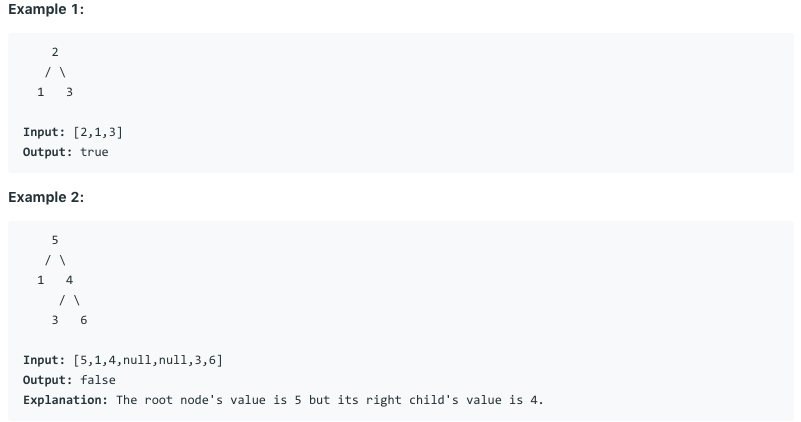

# 问题：98
# Problem: [Validate Binary Search Tree](https://leetcode.com/problems/validate-binary-search-tree/)

## 描述 Description
> Given a binary tree, determine if it is a valid binary search tree (BST).

> Assume a BST is defined as follows:

>> * The left subtree of a node contains only nodes with keys less than the node's key.  
>> * The right subtree of a node contains only nodes with keys greater than the node's key.  
>> * Both the left and right subtrees must also be binary search trees.

> ### 

## 例子 Example

> 


## 分析 Analysis

核心思想：
> 思路1：This is a DFS problem, in-order DFS
>> 时间复杂度：O(n)
>> 空间复杂度：O(n)


## 定义 Definition

### Python


```python


```

### C++

```c++

```


## 解决方案 Solution
```

```
### 1.

> 时间复杂度：O(n)
> 空间复杂度：O(n)

### Python


```python
# Definition for a binary tree node.
# class TreeNode:
#     def __init__(self, x):
#         self.val = x
#         self.left = None
#         self.right = None

class Solution:
    def isValidBST(self, root: TreeNode) -> bool:
        # inorder DFS
        stack = collections.deque()
        p = root
        prev = float('-Inf')
        while p or stack:
            if p:
                stack.append(p)
                p = p.left
            else:
                p = stack.pop()
                if p.val <= prev:
                    return False
                else:
                    prev = p.val
                p = p.right
        return True
        
```

### C++

```c++

```


### 2.

> 时间复杂度：O()
> 空间复杂度：O()

### Python


```python

```

### C++

```c++

```


## 总结

### 1.看到这个问题，我最初是怎么思考的？我是怎么做的？遇到了哪些问题？


### 2.别人是怎么思考的？别人是怎么做的？


### 3.与他的做法相比，我有哪些可以提升的地方？


```python

```
