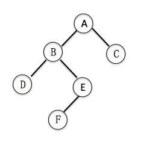
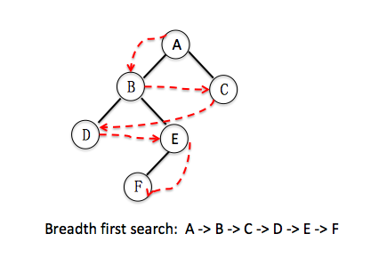
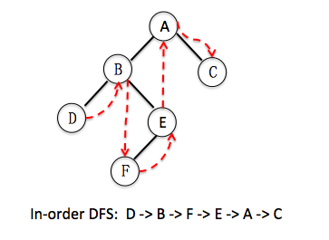
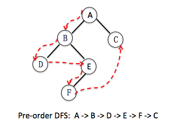
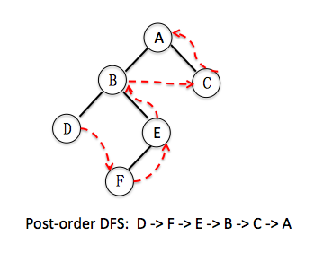

# DFS 模板



```
# 二叉树
class TreeNode:
     def __init__(self, x):
         self.val = x
         self.left = None
         self.right = None
```

## normal BFS




```python
# BFS
def bfs(root):
    if root is None:
        return None
    queue = collections.deque()
    queue.append(root)
    ans = []
    while queue:
        level_size = len(queue)
        for _ in range(level_size):
            cur = queue.popleft()
            ans.append(cur.val)
            if cur.left:
                queue.append(cur.left)
            if cur.right:
                queue.append(cur.right)
    return ans

```
## 树深度优先的遍历

* Time complexity: O(n), n is the node number  
* Space complexity: O(n), n is the node number





## normal DFS

```python

# solution 1, normal recursive implementation
class Solution1:
    def dfs(self, root):
        self.ans = []
        self.inorder(root)
        #self.preorder(root)
        #self.postorder(root)
        return self.ans
    
    def inorder(self, root):
        if root is None: # ending condition
            return
        self.inorder(root.left) # visit left child
        self.ans.append(root.val) # get root node value
        self.inorder(root.right) # visit right child
        
    def preorder(self, root):
        if root is None:
            return
        self.ans.append(root.val)
        self.preorder(root.left)
        self.preorder(root.right)
    
    def postorder(self, root):
        if root is None:
            return
        self.postorder(root.left)
        self.postorder(root.right)
        self.ans.append(root.val)
    

```

## divide and conquer

```python
# solution 2, divide and conquer implementation
class Solution2:
    def dfs(self, root):
        return self.inorder(root)
        # return self.preorder(root)
        # return self.postorder(root)

    
    def inorder(self, root):
        if root is None:
            return []
        # divide
        left = self.inorder(root.left) # result from the left child
        right = self.inorder(root.right) # result from the right child
        # conquer
        return left + [root.val] + right 
    
    def preorder(self, root):
        if root is None:
            return []
        # divide
        left = self.preorder(root.left) # result from the left child
        right = self.preorder(root.right) # result from the right child
        # conquer
        return [root.val] + left + right 
    
    def postorder(self, root):
        if root is None:
            return []
        # divide
        left = self.postorder(root.left) # result from the left child
        right = self.postorder(root.right) # result from the right child
        # conquer
        return left + right + [root.val]
        

```

Normal recursion 和divide and conquer最大的区别在于怎么返回结果，normal recursion把结果放在参数中返回，每一次修改的是同一个变量，比较省空间。而divide and conquer是把结果单独返回，这样可以把左右子树返回的结果进行比较，缺点是比较费空间。所有需要对左右子树进行比较的问题，都需要用divide and conquer。

## non-recursion

```python
# non-recursive (stack) implementation
class Solution3:
    def dfs(self, root):
        return self.inorder(root)
        # return self.preorder(root)
        # return self.postorder(root)
    
    def inorder(self, root):
        if root is None:
            return None
        stack = collections.deque()
        ans = []
        p = root# we need a pointer
        # we will visit every node twice
        # at the visit, we push the node into a stack
        # at the second visit, we pop the node from stack and write the value to answer list
        while p is not None or stack :
            if p is not None:  # first visit
                stack.append(p)
                p = p.left
            else: # current pointer is None and stack is non-empty
                p = stack.pop() # pop the right element, this is the second visit 
                ans.append(p.val)
                p = p.right # point to the right child
        return ans 
    
    def preorder(self, root):
        if root is None:
            return None
        stack = collections.deque()
        ans = []
        p = root
        while p is not None or stack:
            if p is not None:
                ans.append(p.val) # write the value to the answer list at the first visit
                stack.append(p)
                p = p.left
            else:
                p = stack.pop() # this is second visit
                p = p.right
        return ans
    
    def postorder(self, root):
        if root is None:
            return None
        stack = collections.deque()
        ans = []
        p = root
        while p is not None or stack:
            if p is not None:
                if p.right is not None:
                    stack.append(p.right)
                stack.append(p)
                p = p.left
            else:
                p = stack.pop()
                if p.right == stack[-1]: # if right child hasn't been visited, pop right child out and visit if first
                    stack.pop() # pop the right child out
                    stack.append(p)  # push root node back into the stack
                    p = p.right  # visit right child first
                else: # there is no right child or the right child has been visited
                    ans.append(p.val)
                    p = None
        return ans
                           

```